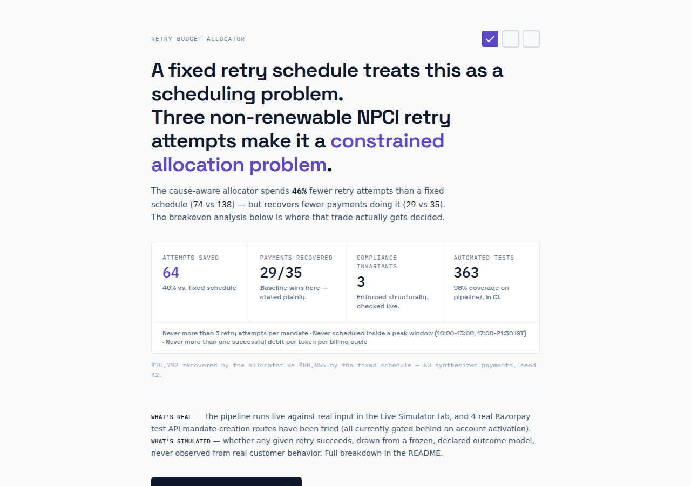
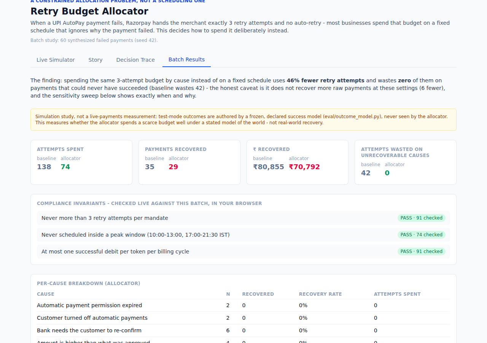
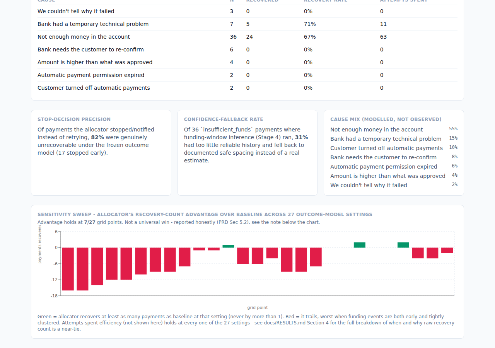

# Retry Budget Allocator

A fixed retry schedule treats a failed UPI AutoPay payment as a scheduling
problem — retry on day 1, day 2, day 3, and hope. It isn't one. NPCI caps a
merchant at exactly 3 retry attempts per mandate, never inside a peak
window, one successful debit per billing cycle. That budget doesn't renew
and it doesn't scale with how many payments fail. Three non-renewable
attempts, spent without knowing in advance which failures can even be
recovered, is a constrained allocation problem — and a fixed schedule that
ignores *why* a payment failed is the wrong tool for it.

Three compliance invariants — never more than 3 attempts, never inside a
peak window, never more than one successful debit per cycle — are asserted
structurally in `pipeline/compliance.py`, checked in tests, and re-run live
against the batch in the dashboard's own browser code. That's a falsifiable
claim: "compliant" here means an assertion that fails loudly if violated,
not a label.

98% test coverage on `pipeline/`, enforced in CI on every push — a weaker
signal than the invariants above, since it measures whether lines
executed, not whether the logic is correct, but it's there too.

## Why a fixed schedule gets this wrong

Razorpay's own S2S documentation is explicit: when a controlled UPI
AutoPay payment fails, there's no automatic retry — the merchant decides
what happens next. Most merchants decide once, with a schedule, not a
policy: retry on a fixed cadence regardless of cause.

That's wrong in two specific, checkable ways:

- **It spends attempts a cause can never convert.** An expired or revoked
  mandate has nothing to retry against — no amount of well-timed retrying
  fixes it. A fixed schedule burns all 3 attempts on it anyway, because it
  never asked why the payment failed in the first place.
- **It ignores timing that actually matters.** An insufficient-balance
  failure — the dominant cause, behind roughly 20 million AutoPay
  revocations a month — is recoverable, but only once the account is
  funded. Retrying blind, before that happens, wastes the attempt.

Neither failure is a scheduling bug. They're both the direct cost of
treating a small, regulated, non-renewable intervention budget as a
calendar problem instead of an allocation one.

## What this builds

A decision layer that classifies the failure cause, then chooses between
notifying the customer, retrying at a specific compliant time, or stopping
early — and records why each decision was made, not just what it was.

- **Deterministic where it should be** — cause classification is a lookup
  over the real Razorpay error object, not a model call. The failure
  taxonomy is small and fully known; a model here would add latency and a
  new failure mode for no benefit.
- **AI where it earns its place** — an LLM writes the plain-language
  reasoning and customer notification copy, and has no say in whether a
  retry happens. An API outage degrades the explanation text, never the
  decision.
- **Every scored candidate kept, not just the winner** — the allocator
  returns all candidate retry windows with their scores and rejection
  reasons, so the reasoning behind a decision is inspectable, not just its
  conclusion.

## Results

Over 60 synthesized failed payments (seed 42), the cause-aware allocator
spends 46% fewer retry attempts than a fixed day-1/2/3 schedule (74 vs 138)
and wastes zero of them on mandates that can never be recovered (the fixed
schedule wastes 42). Compliance violations: zero for either policy, and
that attempts-spent advantage holds across every point in a 27-setting
sensitivity sweep.

What it doesn't do at these parameters is recover more raw payments than
the naive schedule (29 vs 35) — and rather than just note that and move on,
`docs/RESULTS.md` Section 4 digs into why: it's not a confidence problem,
it's structural. Baseline's dense 3-day schedule out-samples the
allocator's wider, PRD-mandated 24h/72h/7d schedule whenever a customer's
funding event lands early. That gap isn't a fluke of one seed either:
re-drawn at 10 different seeds, baseline wins on raw recovery every single
time, and seed 42's gap is actually smaller than the 10-seed average — the
headline sits on the *more flattering* side, not a cherry-picked one
(Section 5). The "7 of 27" sweep number moves more than that, though —
run at each of those same 10 seeds, it ranges from 1/27 to 9/27 (mean
6.6), so read it as roughly representative of that range, not a
seed-independent constant (also Section 5).

That leaves a real question unresolved by either number alone: priced in
rupees per retry attempt (gateway cost, mandatory pre-debit notification,
and the risk-weighted cost of a customer revoking the mandate out of
annoyance — `docs/RESULTS.md` Section 6), the allocator only wins on net
money above **₹157.23 per attempt** — below that, baseline's extra
recovered revenue outweighs its higher attempt spend. Rather than defend
one guess for the two least-certain inputs (how often does aggressive
retrying actually cost a mandate, and what's a customer worth), Section 6
grids both and shows the shape: the allocator only wins on money in the
high-risk/high-customer-value corner (6 of 30 grid cells). Outside that
corner, baseline wins on net value too. That's the actual decision rule
this hands a reader, not a verdict either way.

**[docs/RESULTS.md](docs/RESULTS.md)** has the full numbers: the outcome
model (stated before any result, as it should be), the per-cause breakdown,
the multi-seed stability check, the breakeven surface, and what didn't work.

## What's real and what's simulated

Stated plainly, because the two are easy to blur and shouldn't be:

- **Real:** the pipeline itself runs live in the dashboard's Live
  Simulator tab — every stage executes against whatever payment you build
  or pick, through a small local FastAPI backend, with real per-stage
  timing. The compliance checks are real assertions, not display copy.
  Contact with Razorpay's live test API is real and ongoing: customer and
  order creation succeed against it, and 4 distinct mandate-creation
  routes tried across two sessions (`/payments/create/upi`, `/payments`,
  `/payments/create/ajax`, `/payments/create/recurring`) all return a
  real, captured rejection — evidence that headless mandate creation is
  gated behind a Razorpay Support activation this account doesn't yet
  have live, re-confirmed as recently as 2026-09-15 with fresh
  credentials. `api/razorpay_client.py` is a real, tested, opt-in client
  for this (`LIVE_RAZORPAY=1`) — not fully validated against production,
  since nothing has gotten past this gate yet. See
  `data/fixtures/README.md` for the precise breakdown of every route
  tried and what each result actually shows.
- **Simulated:** whether a scheduled retry actually succeeds is never
  observed — it's drawn from `eval/outcome_model.py`, a model this project
  authored and froze before any allocator logic was tuned, specifically so
  the comparison against it isn't circular. Every headline number (46%
  fewer attempts, 29 vs 35 recovered, the ₹157.23 breakeven) is a
  simulation study against that declared model, not a field measurement.
  The 7 cause fixtures used to build realistic error payloads are a mix of
  Razorpay's own published error-code documentation and, for 3 causes
  Razorpay doesn't document a dedicated error reason for, an inferred
  best-guess from token-lifecycle behavior — labeled by provenance in
  `data/fixtures/README.md`.

## Known gaps

Specific enough to act on, not hedged into meaninglessness:

- **The outcome model is authored, not observed, and the account needed to
  fix that isn't activated yet.** No real success/failure data backs any
  number in this repo. Closing this needs real outcome data from actual
  retry attempts, which needs the mandate-creation gate below to lift
  first. 4 distinct creation routes tried live (most recently 2026-09-15,
  with fresh credentials and an account the user believed already had
  activation) all still return the same rejection — this is a
  Razorpay-Support-conversation prerequisite now, not a code problem
  (`docs/build-log.md`, `data/fixtures/README.md`).
- **The classifier's lookup table covers what's documented, not what
  production actually sends.** A 2026-09-15 audit against Razorpay's
  complete published error-code reference closed the gap between "covers
  what was tested" and "covers everything documented" (3 more codes
  mapped, 3 more deliberately left to fall through to `unknown`/notify
  with reasoning, 5 more explicitly scoped out as mandate-creation or
  merchant-config errors, not charge-failure causes). It has not, and
  cannot yet, close the gap between "documented" and "what a real,
  activated production account would actually send" — that's blocked on
  the same activation as above.
- **A money-path input-validation audit found and fixed one real bug.**
  `attempts_used` indexed a ranked candidate list with no bounds check, so
  a negative value silently picked the worst-scored window instead of
  erroring (`docs/build-log.md`, 2026-09-14). Fixed and tested, and since
  supplemented with property-based fuzzing across every stage that
  actually spends the budget or admits data — the classifier (1200+
  generated cases), the allocator (2400+, including the exact bug class
  above over a wide generated range, not just 4 hand-picked values), and
  ingestion's three constrained fields (1400+) — rather than left as a
  one-pass manual audit. Not exhaustive: `pipeline/decision.py`,
  `pipeline/priors.py`, and `pipeline/funding_window.py` are still
  covered by hand-written unit tests only, not fuzzing.
- **The funding-window inference (Stage 4) has a narrow ceiling by
  design.** Even at high confidence, it can only re-rank the 3 fixed
  24h/72h/7d offsets — it can't schedule at the actually-inferred day if
  that falls between them. `docs/RESULTS.md` Section 4 has the full
  diagnosis.
- **The cost-per-attempt breakeven surface rests on illustrative grids,
  not sourced data.** No public figure exists for either axis (mandate-
  revocation risk per attempt, customer lifetime value) - the *shape* of
  where each policy wins is the useful part, not the specific ₹500-10,000
  and 0-10% ranges chosen for the grid. A merchant with real churn data
  should re-run `eval/economics.py` with their own numbers, not trust
  this grid's edges.

## Docs, evals, and logs — where everything actually is

Every claim in this README traces back to a real file in the repo, not
narrative. This section is the map: a one-line summary of what each thing
is, and exactly where to go for the full detail.

**Documentation** (`docs/`)

- **Results and method** — the outcome model declared before any number,
  the headline, the per-cause breakdown, the multi-seed stability check,
  the breakeven surface, what didn't work, and every limitation, all in
  one place. For more detail, see [docs/RESULTS.md](docs/RESULTS.md).
- **Architecture** — the 7-stage pipeline, data flow, and Mermaid diagrams
  of how a payment actually moves through the system. For more detail,
  see [docs/architecture.md](docs/architecture.md).
- **Full specification** — the original problem brief and every factual
  claim's source citation (NPCI limits, recoverability rates, retry
  spacing). For more detail, see [docs/prd.md](docs/prd.md).
- **Build log** — dated, real entries: every bug found, every live-API
  result actually observed (expected vs. what happened), not reconstructed
  from memory afterward. For more detail, see
  [docs/build-log.md](docs/build-log.md).

**Evaluation code and output** (`eval/`, raw JSON in `eval/results/`)

- **The frozen batch study** — 60 synthesized payments, both policies,
  every decision, scored against the outcome model below.
  `eval/harness.py` produced [eval/results/run_20260915T134833.json](eval/results/run_20260915T134833.json).
- **Sensitivity sweep** — the same batch re-scored across 27 outcome-model
  parameter settings, so one favorable setting can't hide behind the
  headline. `eval/sensitivity.py` produced
  [eval/results/sensitivity.json](eval/results/sensitivity.json).
- **Multi-seed stability** — the batch itself re-drawn at 10 seeds, not
  just re-scored (`eval/results/multiseed.json`), plus the full 27-point
  sweep re-run at each of those same seeds to check whether "7 of 27"
  itself is stable (it ranges 1-9; `eval/results/multiseed_sweep.json`).
  Both produced by `eval/multiseed.py`.
- **Cost-per-attempt breakeven** — the exact crossover point, a swept
  table, and the 2D surface across the two least-certain cost inputs.
  `eval/economics.py` produced
  [eval/results/economics.json](eval/results/economics.json).
- **The frozen outcome model itself** — a declared, seeded
  success-probability model, written and frozen before the allocator's
  own scoring was tuned, never imported by `pipeline/` (mechanically
  enforced by `tests/test_outcome_model_isolation.py`). For more detail,
  see [eval/outcome_model.py](eval/outcome_model.py).

**Raw runtime logs** (`logs/`)

- One real, committed example of structured per-stage execution
  evidence — stage entered/completed, errors caught, fallback triggered —
  is what the build log's narrative entries are actually mined from, not
  written from memory. For more detail, see
  [logs/sample_run.jsonl](logs/sample_run.jsonl). Every full batch run
  writes its own timestamped `logs/<run_id>.jsonl` locally; the rest are
  git-ignored in bulk (regenerable, not narrative evidence) except this
  one committed sample.

**Fixture and live-API provenance** (`data/fixtures/`)

- Which of the 7 cause fixtures are Razorpay-documented, which are
  provisional (inferred, not independently published), and the complete
  log of every live mandate-registration attempt against the real test
  API, including the routes tried and the exact rejection each one
  returned. For more detail, see
  [data/fixtures/README.md](data/fixtures/README.md).

**Constraints that governed the build**

- What was and wasn't up for reinterpretation while building this: hard
  compliance invariants, banned overstated claims (checked against
  `docs/prd.md` Section 2's sources), and the standing instruction to flag
  a gap rather than quietly build around it. For more detail, see
  [CLAUDE.md](CLAUDE.md).

## File structure

Every tracked file, one line each. Folders first, in the order they matter
most to a reader; `tests/` mirrors `pipeline/`/`eval/`/`api/` one file at a
time so it's grouped at the end rather than repeated inline. `__init__.py`
in `pipeline/`, `eval/`, and `api/` are empty package markers, left out
below since there's nothing to say about them individually.

    CLAUDE.md                  engineering constraints that governed the build
    LICENSE                    MIT
    README.md                  this file
    requirements.txt           Python dependencies
    pyproject.toml             pytest + ruff config
    setup.sh                   one-time bootstrap (venv, deps, .env template)
    .env.example                credential template - copy to .env, fill in keys
    .gitignore
    .github/workflows/ci.yml   GitHub Actions - pytest + ruff on every push

    pipeline/                  the 7-stage decision engine (Sec 4)
    ├── models.py               shared schemas - FailureCause, RazorpayError, StageTrace
    ├── ingest.py                Stage 1 - validates a raw event into FailedPaymentEvent
    ├── classify.py              Stage 2 - deterministic cause lookup, never a model call
    ├── priors.py                Stage 3 - recoverability score + action shape per cause
    ├── funding_window.py        Stage 4 - confidence-gated funding-window inference
    ├── allocator.py             Stage 5 - notify/retry-at-T/stop, every candidate scored
    ├── decision.py               Stage 6 - assembles every prior stage into one record
    ├── explain.py                Stage 7 - the one LLM call in this codebase
    ├── compliance.py            the 3 hard invariants (attempt cap, peak windows, 1/cycle)
    └── run.py                   orchestrates Stages 2-6 for one ingested event

    eval/                       frozen outcome model, baseline, batch analysis (Sec 5)
    │                           - never imported by pipeline/, enforced by
    │                           tests/test_outcome_model_isolation.py
    ├── outcome_model.py         frozen, seeded success-probability model
    ├── baseline.py               fixed day-1/2/3 schedule comparator
    ├── batch_generator.py        synthesizes the 60-payment batch from a fixed anchor time
    ├── harness.py                 runs both policies over the batch, writes run_*.json
    ├── sensitivity.py            27-point outcome-model parameter sweep
    ├── multiseed.py               re-draws the batch at 10 seeds AND re-sweeps at each
    ├── economics.py               cost-per-attempt breakeven point, sweep, and 2D surface
    └── results/                  committed JSON output from the 5 modules above
        ├── run_20260915T134833.json   the frozen batch run - both policies, every decision
        ├── sensitivity.json           the 27-setting sweep result
        ├── multiseed.json             the 10-seed stability result (default parameters)
        ├── multiseed_sweep.json       the 10-seed stability result (full 27-point sweep)
        └── economics.json             the breakeven point, sweep, and surface

    api/                        FastAPI backend
    ├── main.py                  POST /api/simulate (live pipeline), /api/webhooks/razorpay
    ├── personas.py                5 named live-simulator scenarios
    └── razorpay_client.py        opt-in (LIVE_RAZORPAY=1) real Razorpay test-API client

    dashboard/                  React + Tailwind UI
    ├── index.html
    ├── package.json / package-lock.json
    ├── vite.config.js
    ├── .oxlintrc.json             lint config (npm run lint)
    ├── .gitignore                 dashboard-local ignores (node_modules, dist)
    ├── README.md                 how to run the dashboard and refresh its data
    ├── public/
    │   ├── favicon.svg
    │   └── data/                  static copies of eval/results/*.json the dashboard reads
    └── src/
        ├── main.jsx                React entry point
        ├── App.jsx                 landing/dashboard routing, tab state
        ├── index.css                Tailwind import, fonts, the accent-color token
        ├── lib/
        │   ├── useRunData.js       fetches the saved run + sensitivity JSON
        │   ├── format.js            plain-language labels, money/date formatting
        │   ├── compliance.js        client-side JS port of the 3 compliance checks
        │   └── simulate.js          calls the live /api/simulate endpoint
        └── views/
            ├── LandingPage.jsx           thesis, headline result, scorecard, one CTA
            ├── LiveSimulatorView.jsx      live pipeline runs, persona picker, custom input
            ├── StoryView.jsx               plain-language narrative for one payment
            ├── DecisionTraceView.jsx      full technical trace for one payment
            └── BatchResultsView.jsx        stat cards, compliance panel, sensitivity chart

    data/
    ├── fixtures/                 the 7 cause fixtures + provenance (Sec 5.0)
    │   ├── README.md              which fixtures are documented/provisional/live, full probe log
    │   ├── insufficient_funds.json, bank_technical.json, afa_required.json
    │   │                          Razorpay-documented, verbatim from published error-code docs
    │   ├── mandate_revoked.json, mandate_expired.json, amount_exceeds_mandate.json
    │   │                          provisional - inferred from token-lifecycle docs, not published
    │   ├── unknown.json            what an unclassifiable error object looks like
    │   ├── _capture_attempts.json  raw evidence from the first live-API capture (2026-09-03)
    │   └── _live_mandate_probe.json raw evidence from the 2026-09-15 re-verification
    └── runs/run_20260915T134833.json   the dashboard's read-only data source (Sec 6.2)

    docs/
    ├── prd.md                     full specification, every claim's source citation
    ├── architecture.md            pipeline design, data flow, Mermaid diagrams
    ├── RESULTS.md                 the full results write-up, method, limitations
    ├── build-log.md               dated, real entries - every bug found and how it was fixed
    └── images/                    the 5 screenshots used in this README

    tests/                      one file per module above plus:
    ├── test_classify_fuzz.py     property-based fuzzing of Stage 2 (1200+ cases)
    ├── test_allocator_fuzz.py     property-based fuzzing of Stage 5 (2400+ cases)
    ├── test_ingest_fuzz.py         property-based fuzzing of Stage 1's constrained fields (1400+ cases)
    ├── test_outcome_model_isolation.py   AST check - pipeline/ never imports eval.outcome_model
    ├── test_fixtures.py           every captured fixture classifies as its filename claims
    └── (one test_<module>.py for every pipeline/, eval/, and api/ module above)

    scripts/                    one-off live-API probes, never imported by anything else
    ├── capture_fixtures.py       first live-API capture (customer/order/payment routes)
    └── live_mandate_probe.py     2026-09-15 re-verification with fresh credentials

    logs/sample_run.jsonl       one committed example of real per-stage execution evidence

## Setup

    bash setup.sh
    cp .env.example .env    # fill in keys
    source .venv/bin/activate
    pytest

## Dashboard

A landing page first: the thesis, the headline result with its caveat in
the same sentence, and a plain scorecard — readable in under 30 seconds
without touching anything interactive. One button from there into the full
dashboard's four tabs: a Live Simulator (opt-in live mode — calls the real
pipeline through a small local API, never the real Razorpay API), plus
Story, Decision Trace, and Batch Results, which read from a saved run
artifact: static files only, no live calls. The batch study itself stays
fixed and pre-computed either way.

    # terminal 1 - backend for the Live Simulator tab
    source .venv/bin/activate
    uvicorn api.main:app --reload --port 8000

    # terminal 2 - dashboard
    cd dashboard
    npm install
    npm run dev

The other three tabs work fine without the backend running; only Live
Simulator needs it. See [dashboard/README.md](dashboard/README.md) for how
to refresh the batch data after a new run.

## Authorship

This codebase was built by an AI coding assistant working from written
specifications, directed and reviewed by a human throughout rather than
run autonomously — every non-trivial design decision (the compliance
invariants, the outcome-model isolation rule, when to flag a gap instead
of silently building around it) was specified or checked before being
built, not generated and accepted unread.

The files where a subtle bug would be a money bug —
`pipeline/allocator.py`, `pipeline/compliance.py`, `pipeline/priors.py`,
`pipeline/classify.py`, `eval/baseline.py`, `eval/economics.py`,
`api/razorpay_client.py`, and the Pydantic validation in
`pipeline/ingest.py` — got the heaviest scrutiny of anything in the repo:
a dedicated adversarial-input audit that found and fixed a real fail-open
bug (`docs/build-log.md`, 2026-09-14: negative `attempts_used` silently
picked the worst-scored retry window instead of erroring), later
supplemented with property-based fuzzing (1200+ generated cases against
the classifier, not just the hand-picked ones), and a documented-error-code
audit against Razorpay's own published reference rather than working from
memory. That review is real and repeatable — the regression tests and
fuzz properties it produced are in `tests/`, not just the fixes.

`CLAUDE.md`, kept in the repo rather than deleted once the build finished,
is the actual record of what the assistant was and wasn't permitted to
decide on its own: hard constraints that could not be silently reinterpreted,
claims that were checked against Sec 2's sources and banned once found
false or overstated, and the standing instruction to flag a conflict or a
gap explicitly rather than build the disallowed thing quietly. It's a
record of judgment calls made during the build, not a boilerplate config
file.
