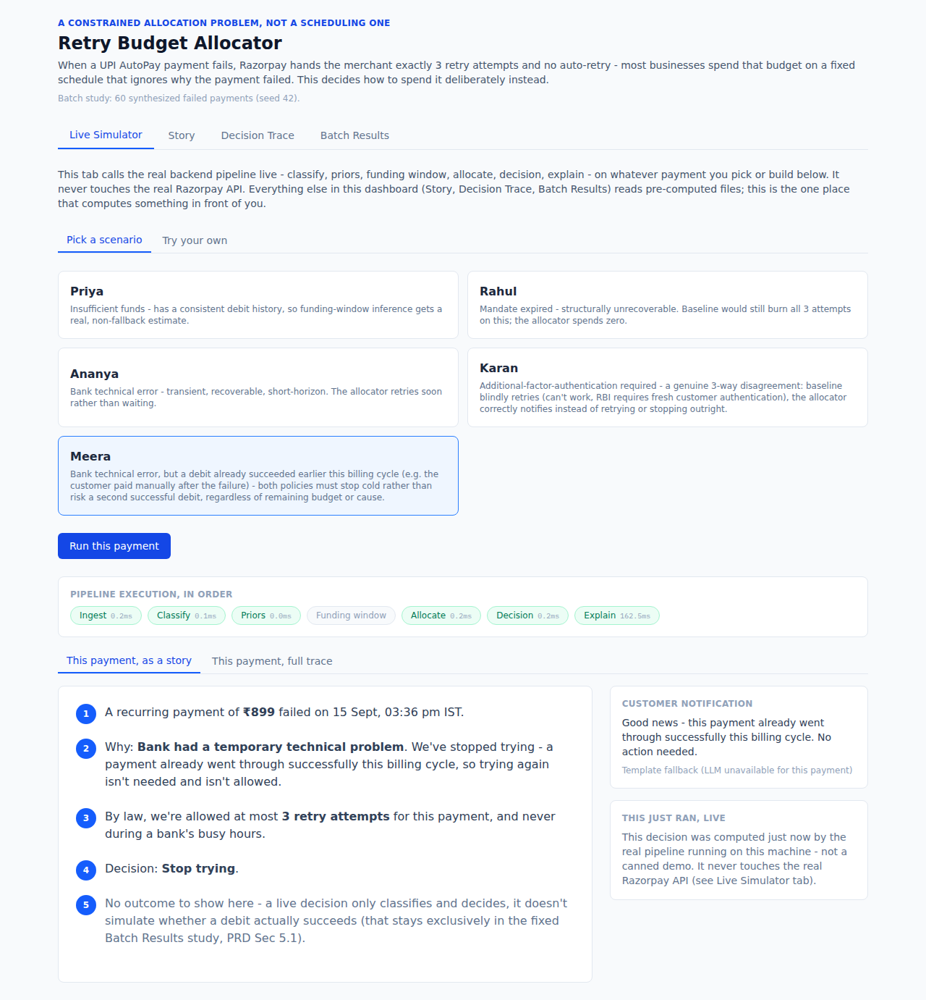
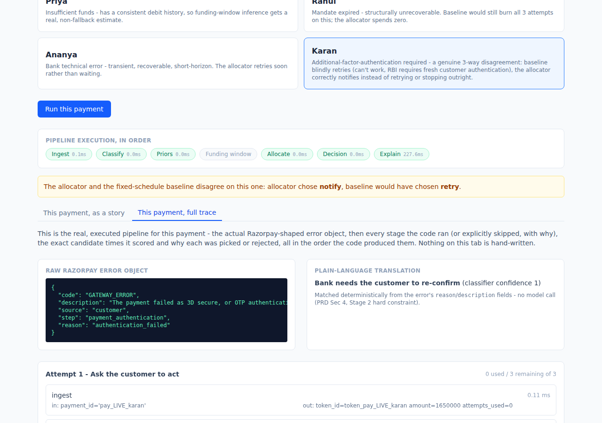

# Retry Budget Allocator

**Razorpay AI Buildathon 2026 — Track 3: AI Revenue Recovery**

98% test coverage on `pipeline/` (279 tests total across `pipeline/`, `eval/`, and `api/`, `pytest --cov=pipeline`) — enforced in CI on every push.

**[docs/video/dashboard-walkthrough.mp4](docs/video/dashboard-walkthrough.mp4)**
— narrated screen capture (5:10) of every tab and option: all four Live
Simulator personas plus the custom form in both cause-dropdown and
raw-JSON modes, two payments each on Story and Decision Trace, and a full
scroll through Batch Results. Voiceover explains the architecture, the
workflow, and the reasoning behind each decision, timed to what's on
screen. Machine-narrated walkthrough footage, not the final human-recorded
pitch video.

## The problem

When a UPI AutoPay recurring payment fails, Razorpay's controlled flow hands
retry responsibility back to the merchant. Its own S2S documentation says as
much: no automatic retry is attempted, and the merchant has to retry
manually.

That leaves the merchant with a hard budget of three NPCI-permitted retry
attempts, restricted to non-peak windows, with only one successful debit
allowed per billing cycle.

Most merchants spend that budget on a fixed schedule that ignores *why* the
payment failed. An expired or revoked mandate consumes attempts it can never
convert. An insufficient-balance failure — the dominant cause, behind
roughly 20 million AutoPay revocations a month — burns through all three
attempts within days, often before the customer's account is funded again.

It's a constrained allocation problem, not a scheduling one: a small,
regulated, non-renewable budget of interventions, spent without knowing in
advance which failures are even recoverable.

## What this builds

A decision layer that classifies the failure cause, chooses between
notifying, retrying at a specific compliant time, or stopping early, and
records why each decision was made.

- **Deterministic where it should be** — cause classification is a lookup
  over the real Razorpay error object, not a model call.
- **AI where it earns its place** — an LLM writes the plain-language
  reasoning and customer notification copy, and has no say in whether a
  retry happens.
- **Compliance proven, not claimed** — invariants (max 3 attempts, no
  peak-window scheduling, one debit per cycle) are asserted in tests and
  re-run live against the batch.

## Results

Over 60 synthesized failed payments (seed 42), the cause-aware allocator
spends 46% fewer retry attempts than a fixed day-1/2/3 schedule (74 vs 138)
and wastes zero of them on mandates that can never be recovered (the fixed
schedule wastes 42). Compliance violations: zero for either policy, and
that attempts-spent advantage holds across every point in a 27-setting
sensitivity sweep.

What it doesn't do at these parameters is recover more raw payments than
the naive schedule (29 vs 35) — and rather than just note that and move on,
`docs/RESULTS.md` Section 4 digs into why: it's not a confidence problem,
it's structural. Baseline's dense 3-day schedule out-samples the
allocator's wider, PRD-mandated 24h/72h/7d schedule whenever a customer's
funding event lands early.

**[docs/RESULTS.md](docs/RESULTS.md)** has the full numbers: the outcome
model (stated before any result, as it should be), the per-cause breakdown,
the sensitivity sweep, and what didn't work. Read it as a simulation study
against a declared outcome model — not a field measurement of anything.

## Docs

- [docs/RESULTS.md](docs/RESULTS.md) — results, method, and limitations
- [docs/architecture.md](docs/architecture.md) — pipeline design and data flow
- [docs/prd.md](docs/prd.md) — full specification and verified sources
- [docs/build-log.md](docs/build-log.md) — what broke during the build and how it was fixed

## Repo layout

    pipeline/   the 7-stage decision engine (Sec 4) - classify, priors,
                funding window, allocate, decision, explain
    eval/       frozen outcome model, baseline, batch harness, sensitivity
                sweep (Sec 5) - never imported by pipeline/
    api/        FastAPI backend for the dashboard's Live Simulator tab
    dashboard/  React + Tailwind UI - Live Simulator, Story, Decision
                Trace, Batch Results
    data/       fixtures (Sec 5.0 provenance) and saved run artifacts
    docs/       results, architecture, build log, PRD, pitch script
    tests/      one test file per pipeline/eval/api module

## Setup

    bash setup.sh
    cp .env.example .env    # fill in keys
    source .venv/bin/activate
    pytest

## Dashboard

Four tabs. A Live Simulator (PRD Sec 6.2's opt-in live mode — calls the real
pipeline through a small local API, never the real Razorpay API), plus
Story, Decision Trace, and Batch Results, which read from a saved run
artifact: static files only, no live calls. The batch study itself stays
fixed and pre-computed either way.

    # terminal 1 - backend for the Live Simulator tab
    source .venv/bin/activate
    uvicorn api.main:app --reload --port 8000

    # terminal 2 - dashboard
    cd dashboard
    npm install
    npm run dev

The other three tabs work fine without the backend running; only Live
Simulator needs it. See [dashboard/README.md](dashboard/README.md) for how
to refresh the batch data after a new run.
