## Problem statement

A fixed retry schedule treats a failed UPI AutoPay payment as a scheduling
problem — retry on day 1, day 2, day 3, and hope. It isn't one. NPCI caps a
merchant at exactly 3 retry attempts per mandate, never inside a peak
window, one successful debit per billing cycle. That budget doesn't renew
and it doesn't scale with how many payments fail. Three non-renewable
attempts, spent without knowing in advance which failures can even be
recovered, is a constrained allocation problem — and a fixed schedule that
ignores *why* a payment failed is the wrong tool for it.

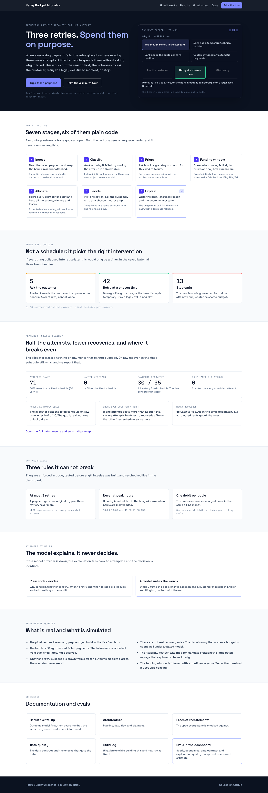

### Take the tour

The dashboard opens on a guided walkthrough that follows one real failed
payment from the saved run through every stage, with a plain-language
glossary beside it. Each step links to the tab where you can go deeper, and
an "Every page, in one place" map underneath says what each tab holds.

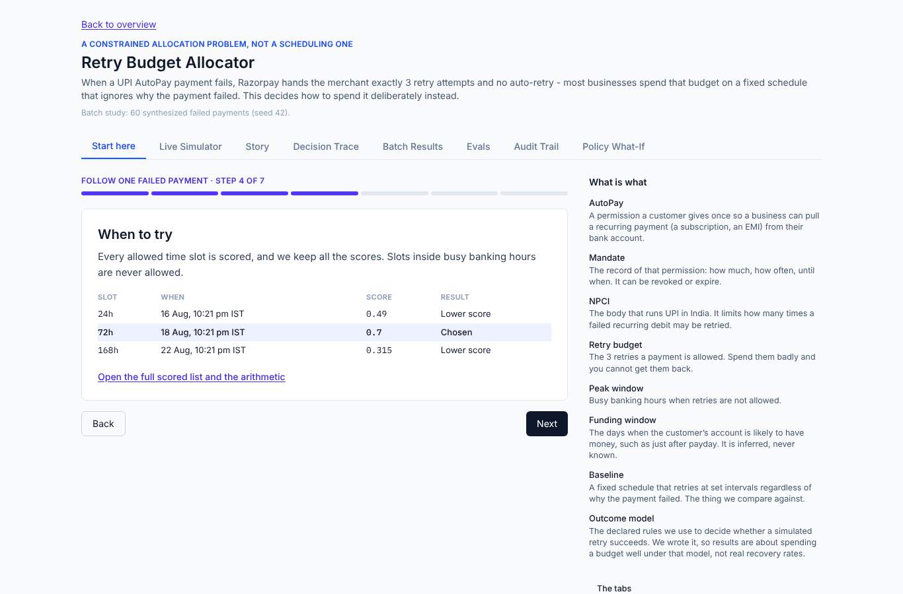

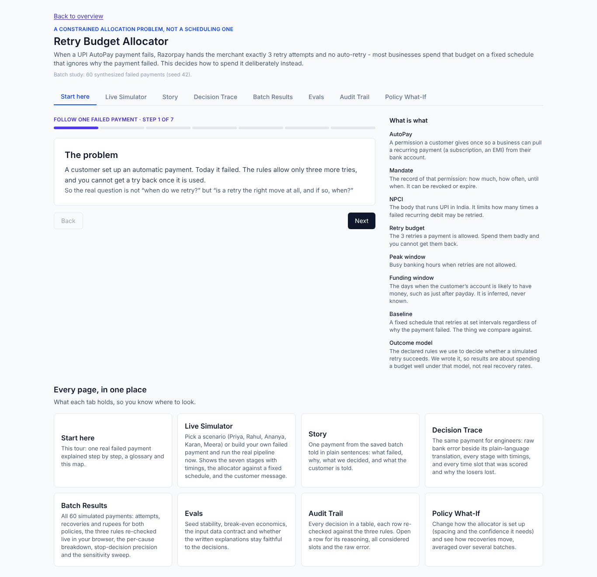

### Explore

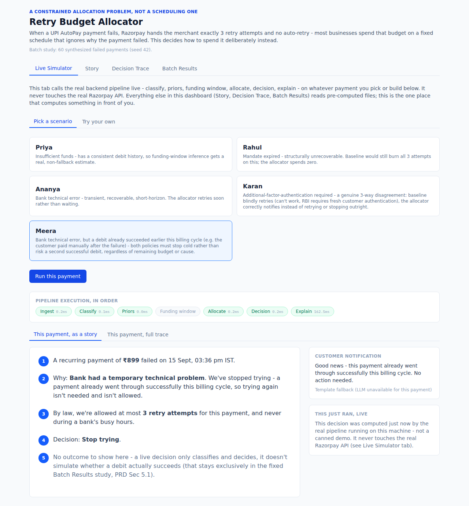
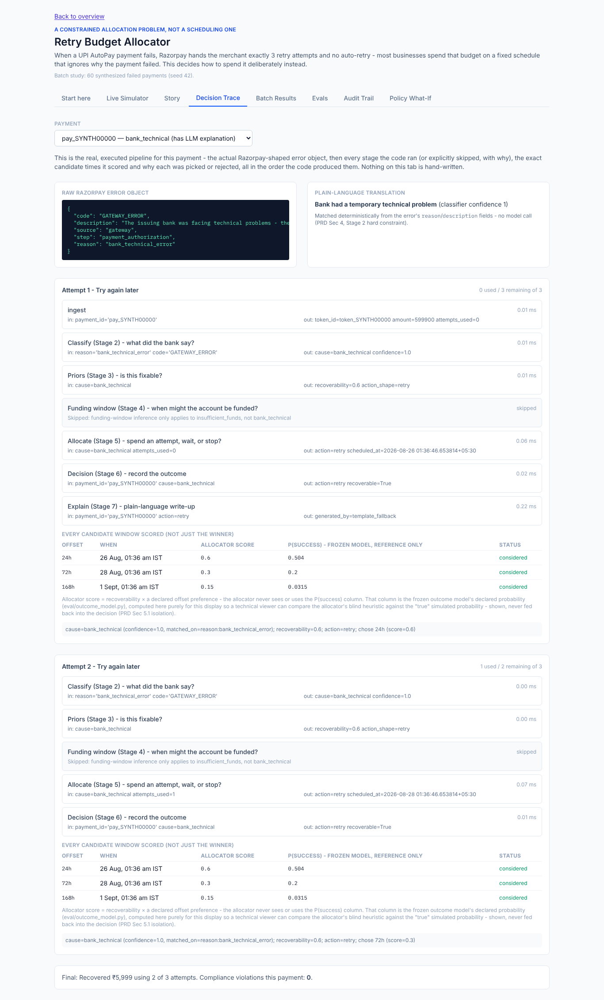
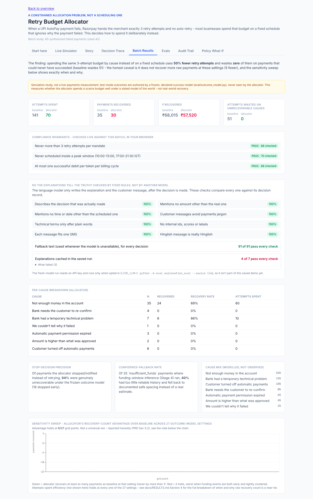
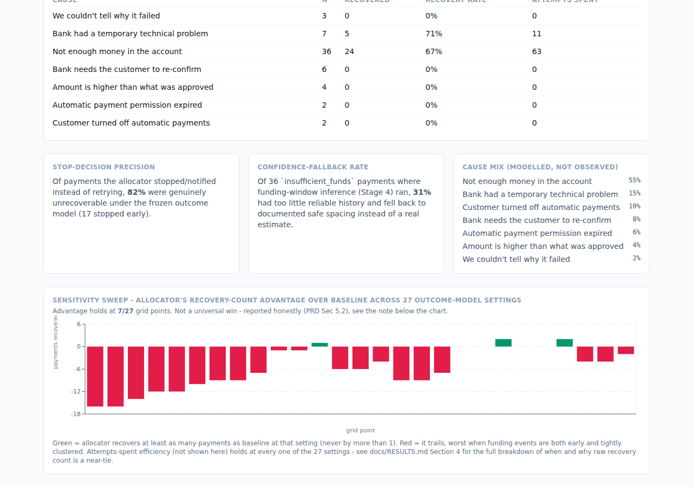
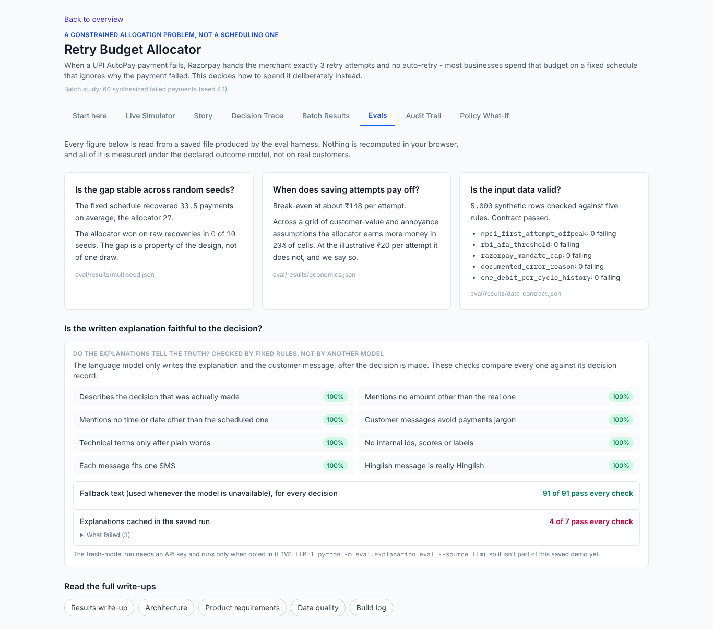

Three compliance invariants — never more than 3 attempts, never inside a
peak window, never more than one successful debit per cycle — are asserted
structurally in `pipeline/compliance.py`, checked in tests, and re-run live
against the batch in the dashboard's own browser code. That's a falsifiable
claim: "compliant" here means an assertion that fails loudly if violated,
not a label.

[](https://github.com/Asha0509/retry-budget-allocator/actions/workflows/ci.yml)
[](https://github.com/Asha0509/retry-budget-allocator/actions/workflows/quality.yml)
[](https://github.com/Asha0509/retry-budget-allocator/actions/workflows/codeql.yml)
98% test coverage on `pipeline/`, enforced in CI on every push — a weaker
signal than the invariants above, since it measures whether lines
executed, not whether the logic is correct, but it's there too.


**Contents:** [Problem](#problem-statement) · [Solution](#solution) · [File structure](#file-structure) · [User flow](#user-flow) · [LLD](#low-level-design-lld) · [HLD](#high-level-design-hld) · [Scaling](#how-it-would-scale) · [USP](#usp-what-is-different-and-why-it-is-better) · [Tools](#tools-and-software-used) · [Principles](#principles-used) · [Requirements](#functional-and-non-functional-requirements) · [Results](#results) · [Known gaps](#known-gaps) · [CI/CD](#engineering-quality-and-cicd) · [Setup](#setup)

### Why a fixed schedule gets this wrong

Razorpay's own S2S documentation is explicit: when a controlled UPI
AutoPay payment fails, there's no automatic retry — the merchant decides
what happens next. Most merchants decide once, with a schedule, not a
policy: retry on a fixed cadence regardless of cause.

That's wrong in two specific, checkable ways:

- **It spends attempts a cause can never convert.** An expired or revoked
  mandate has nothing to retry against — no amount of well-timed retrying
  fixes it. A fixed schedule burns all 3 attempts on it anyway, because it
  never asked why the payment failed in the first place.
- **It ignores timing that actually matters.** An insufficient-balance
  failure — the dominant cause, behind roughly 20 million AutoPay
  revocations a month — is recoverable, but only once the account is
  funded. Retrying blind, before that happens, wastes the attempt.

Neither failure is a scheduling bug. They're both the direct cost of
treating a small, regulated, non-renewable intervention budget as a
calendar problem instead of an allocation one.

## Solution

A decision layer that classifies the failure cause, then chooses between
notifying the customer, retrying at a specific compliant time, or stopping
early — and records why each decision was made, not just what it was.

- **Deterministic where it should be** — cause classification is a lookup
  over the real Razorpay error object, not a model call. The failure
  taxonomy is small and fully known; a model here would add latency and a
  new failure mode for no benefit.
- **AI where it earns its place** — an LLM writes the plain-language
  reasoning and customer notification copy, and has no say in whether a
  retry happens. An API outage degrades the explanation text, never the
  decision.
- **Every scored candidate kept, not just the winner** — the allocator
  returns all candidate retry windows with their scores and rejection
  reasons, so the reasoning behind a decision is inspectable, not just its
  conclusion.

**The seven stages** (`pipeline/`): 1 Ingest (validate the event) -> 2 Classify (deterministic lookup of the cause) -> 3 Priors (is it recoverable, and what action shape) -> 4 Funding window (probabilistic, falls back to safe spacing) -> 5 Allocate (score every candidate window, subject to compliance) -> 6 Decision record -> 7 Explain (LLM wording only, template fallback). Each stage returns a structured trace entry.


## File structure

Every tracked file, one line each, as a single tree so the nesting is
visible. `tests/` mirrors `pipeline/`/`eval/`/`api/` one file at a time, so
it is described once at the end rather than repeated inline. `__init__.py`
in `pipeline/`, `eval/`, and `api/` are empty package markers, left out
below since there's nothing to say about them individually.

```text
retry-budget-allocator/
├── CLAUDE.md                                   engineering constraints that governed the build
├── LICENSE                                     MIT
├── README.md                                   this file
├── requirements.txt                            Python dependencies
├── pyproject.toml                              pytest + ruff config
├── setup.sh                                    one-time bootstrap (venv, deps, .env template)
├── .env.example                                credential template - copy to .env, fill in keys
├── .gitignore
├── render.yaml                                 Render blueprint: API + static dashboard, deploy only after checks pass
├── .github/
│   ├── workflows/                              ci.yml (tests, eval gates, dashboard build), quality.yml (vulture, xenon, jscpd), codeql.yml, scorecard.yml, mutation.yml (weekly mutmut on compliance.py)
│   └── dependabot.yml                          weekly pip, npm and Actions updates
├── scripts/
│   ├── validate.sh                             one-command validation: lint, tests, data contract, eval gates, dashboard build
│   ├── ci_eval_summary.py                      writes the eval summary to the CI run page; fails the job if a gate breaks
│   ├── capture_fixtures.py                     first live-API capture (customer/order/payment routes)
│   └── live_mandate_probe.py                   2026-09-15 re-verification with fresh credentials
├── pipeline/                                   the 7-stage decision engine (Sec 4)
│   ├── models.py                               shared schemas - FailureCause, RazorpayError, StageTrace
│   ├── ingest.py                               Stage 1 - validates a raw event into FailedPaymentEvent
│   ├── classify.py                             Stage 2 - deterministic cause lookup, never a model call
│   ├── priors.py                               Stage 3 - recoverability score + action shape per cause
│   ├── funding_window.py                       Stage 4 - confidence-gated funding-window inference
│   ├── allocator.py                            Stage 5 - notify/retry-at-T/stop, every candidate scored
│   ├── decision.py                             Stage 6 - assembles every prior stage into one record
│   ├── explain.py                              Stage 7 - the one LLM call in this codebase
│   ├── compliance.py                           the 3 hard invariants (attempt cap, peak windows, 1/cycle)
│   └── run.py                                  orchestrates Stages 2-6 for one ingested event
├── eval/                                       frozen outcome model, baseline, batch analysis (Sec 5); never imported by pipeline/
│   ├── outcome_model.py                        frozen, seeded success-probability model
│   ├── baseline.py                             fixed day-1/2/3 schedule comparator
│   ├── batch_generator.py                      synthesizes the 60-payment batch from a fixed anchor time
│   ├── harness.py                              runs both policies over the batch, writes run_*.json
│   ├── sensitivity.py                          27-point outcome-model parameter sweep
│   ├── multiseed.py                            re-draws the batch at 10 seeds and re-sweeps at each
│   ├── economics.py                            cost-per-attempt breakeven point, sweep, and 2D surface
│   ├── policy_whatif.py                        what-if over the allocator's own knobs (confidence threshold, spacing)
│   ├── explanation_eval.py                     faithfulness checks over (decision, explanation)
│   ├── data_contract.py                        Pandera contract over the generated batch
│   └── results/                                committed JSON output from the modules above
│       ├── run_20261008T100907.json            the frozen batch run - both policies, every decision
│       ├── sensitivity.json                    the 27-setting sweep result
│       ├── multiseed.json, multiseed_sweep.json  the 10-seed stability results
│       ├── economics.json                      the breakeven point, sweep, and surface
│       ├── data_contract.json                  data-contract result for the 5,000-event batch
│       └── policy_whatif.json, explanation_eval_*.json  what-if and explanation-eval outputs
├── api/                                        FastAPI backend
│   ├── main.py                                 POST /api/simulate (live pipeline, rate limited, size-capped), /api/webhooks/razorpay (HMAC-signed, closed without a secret)
│   ├── personas.py                             5 named live-simulator scenarios
│   └── razorpay_client.py                      opt-in (LIVE_RAZORPAY=1) real Razorpay test-API client
├── dashboard/                                  React + Tailwind UI
│   ├── index.html
│   ├── package.json, package-lock.json
│   ├── vite.config.js
│   ├── .oxlintrc.json                          lint config (npm run lint)
│   ├── .gitignore                              dashboard-local ignores (node_modules, dist)
│   ├── README.md                               how to run the dashboard and refresh its data
│   ├── public/
│   │   ├── favicon.svg
│   │   └── data/                               static copies of eval/results/*.json the dashboard reads
│   └── src/
│       ├── main.jsx                            React entry point
│       ├── App.jsx                             landing/dashboard routing, tab state
│       ├── index.css                           Tailwind import, fonts, the accent-color token
│       ├── components/
│       │   └── HeroDiagram.jsx                 click a failure reason, see which of the 3 interventions it routes to
│       ├── lib/
│       │   ├── useRunData.js                   fetches the saved run + sensitivity JSON
│       │   ├── useJson.js                      optional saved artifacts (seeds, economics, data contract)
│       │   ├── site.js                         shared copy: stages, interventions, rules, glossary, page map, doc links
│       │   ├── format.js                       plain-language labels, money/date formatting
│       │   ├── csv.js                          CSV writer + download for the audit-trail export
│       │   ├── compliance.js                   client-side JS port of the 3 compliance checks
│       │   └── simulate.js                     calls the live /api/simulate endpoint
│       └── views/
│           ├── LandingPage.jsx                 hero + interactive diagram, 7 stages, results, rules, AI role, honesty notes, docs
│           ├── GuideView.jsx                   guided tour of one real payment, glossary, map of every page
│           ├── EvalsView.jsx                   seed stability, break-even economics, data contract, explanation eval
│           ├── LiveSimulatorView.jsx           live pipeline runs, persona picker, custom input
│           ├── StoryView.jsx                   plain-language narrative for one payment
│           ├── DecisionTraceView.jsx           full technical trace for one payment
│           ├── BatchResultsView.jsx            stat cards, compliance panel, sensitivity chart
│           ├── ExplanationEvalPanel.jsx        explanation faithfulness results shown on the Evals tab
│           ├── AuditTrailView.jsx              every decision with its rule checks
│           └── WhatIfView.jsx                  change the allocator's knobs, see recoveries move
├── data/
│   ├── fixtures/                               the 7 cause fixtures + provenance (Sec 5.0)
│   │   ├── README.md                           which fixtures are documented/provisional/live, full probe log
│   │   ├── insufficient_funds.json, bank_technical.json, afa_required.json  Razorpay-documented, verbatim from published docs
│   │   ├── mandate_revoked.json, mandate_expired.json, amount_exceeds_mandate.json  provisional - inferred, not published
│   │   ├── unknown.json                        what an unclassifiable error object looks like
│   │   ├── _capture_attempts.json              raw evidence from the first live-API capture (2026-09-03)
│   │   └── _live_mandate_probe.json            raw evidence from the 2026-09-15 re-verification
│   └── runs/run_20261008T100907.json           the dashboard's read-only data source (Sec 6.2)
├── docs/
│   ├── prd.md                                  full specification, every claim's source citation
│   ├── architecture.md                         pipeline design, data flow, Mermaid diagrams
│   ├── DATA_QUALITY.md                         data-contract result and its limits
│   ├── RESULTS.md                              the full results write-up, method, limitations
│   ├── build-log.md                            dated, real entries - every bug found and how it was fixed
│   └── images/                                 screenshots used in this README
├── tests/                                      one test_<module>.py per pipeline/, eval/ and api/ module, plus
│   ├── test_classify_fuzz.py                   property-based fuzzing of Stage 2 (1200+ cases)
│   ├── test_allocator_fuzz.py                  property-based fuzzing of Stage 5 (2400+ cases)
│   ├── test_ingest_fuzz.py                     property-based fuzzing of Stage 1 (1400+ cases)
│   ├── test_outcome_model_isolation.py         AST check - pipeline/ never imports eval.outcome_model
│   ├── test_fixtures.py                        every captured fixture classifies as its filename claims
│   ├── test_data_contract.py                   the contract accepts good rows and rejects each kind of bad row
│   └── test_batch_generator.py                 generated batches obey the payment-rail rules
└── logs/sample_run.jsonl                       one committed example of real per-stage execution evidence
```

### How the files connect

Arrows mean "imports" or "reads". The dashed line is the one rule that is
enforced by a test: `pipeline/` never sees the outcome model.

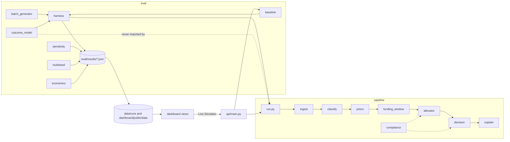
```mermaid
flowchart LR
  subgraph pipeline
    ingest --> classify --> priors --> funding_window --> allocator --> decision --> explain
    compliance -.-> allocator
    compliance -.-> decision
    run[run.py] --> ingest
  end
  subgraph eval
    batch_generator --> harness
    baseline --> harness
    outcome_model --> harness
    harness --> results[("eval/results/*.json")]
    sensitivity --> results
    multiseed --> results
    economics --> results
  end
  harness --> run
  outcome_model -. "never imported by" .-x run
  results --> data[("data/runs and dashboard/public/data")]
  data --> dashboard[dashboard views]
  api[api/main.py] --> run
  api --> baseline
  dashboard -- Live Simulator --> api
```

## User flow

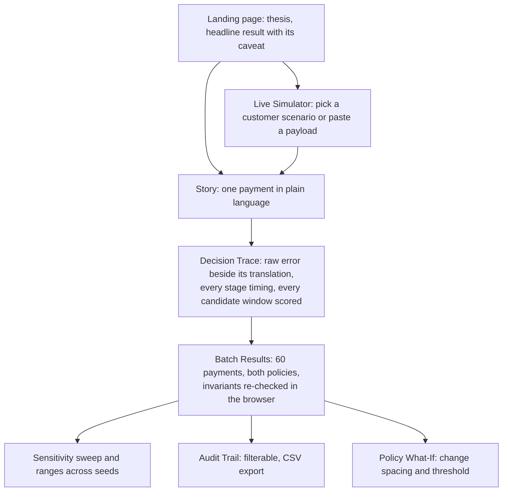
```mermaid
flowchart TD
    L["Landing page: thesis, headline result with its caveat"] --> LIVE["Live Simulator: pick a customer scenario or paste a payload"]
    L --> S["Story: one payment in plain language"]
    LIVE --> S
    S --> T["Decision Trace: raw error beside its translation,<br/>every stage timing, every candidate window scored"]
    T --> B["Batch Results: 60 payments, both policies,<br/>invariants re-checked in the browser"]
    B --> SW["Sensitivity sweep and ranges across seeds"]
    B --> AU["Audit Trail: filterable, CSV export"]
    B --> WI["Policy What-If: change spacing and threshold"]
```

**Explanation.** A reader lands on a plain-language thesis with the headline result and its caveat, then either runs the Live Simulator on a customer scenario or reads one payment as a story. The decision trace shows the raw error next to its translation, stage timings and every scored window. Batch Results compares both policies over 60 payments and re-checks the compliance invariants in the browser; the sweep, audit trail and policy what-if let a reader test how far the result depends on assumptions.


## Low-level design (LLD)

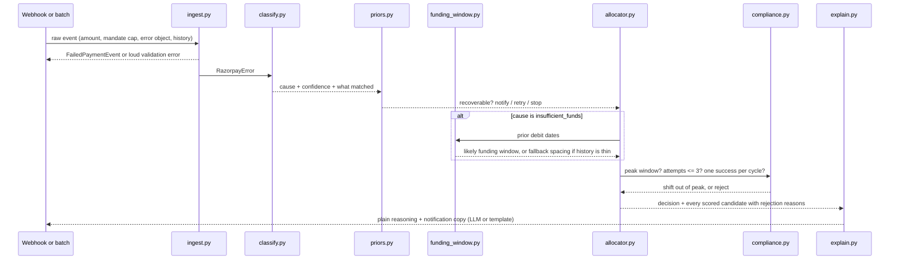
```mermaid
sequenceDiagram
    participant W as Webhook or batch
    participant I as ingest.py
    participant C as classify.py
    participant P as priors.py
    participant F as funding_window.py
    participant A as allocator.py
    participant K as compliance.py
    participant X as explain.py
    W->>I: raw event (amount, mandate cap, error object, history)
    I-->>W: FailedPaymentEvent or loud validation error
    I->>C: RazorpayError
    C-->>P: cause + confidence + what matched
    P-->>A: recoverable? notify / retry / stop
    alt cause is insufficient_funds
        A->>F: prior debit dates
        F-->>A: likely funding window, or fallback spacing if history is thin
    end
    A->>K: peak window? attempts <= 3? one success per cycle?
    K-->>A: shift out of peak, or reject
    A-->>X: decision + every scored candidate with rejection reasons
    X-->>W: plain reasoning + notification copy (LLM or template)
```

**Explanation.** One failed payment is validated, classified by a lookup, given a recoverability prior and, for insufficient funds, a funding-window estimate from its debit history (falling back to fixed spacing when the history is thin). The allocator scores every candidate window; the compliance module shifts or rejects anything inside a peak window, over the three-attempt cap or breaking one-debit-per-cycle. The decision record keeps all candidates and rejection reasons, and the explainer only rewrites it in plain language.


## High-level design (HLD)

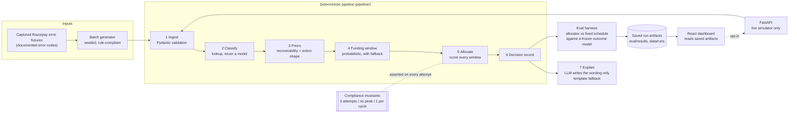
```mermaid
flowchart LR
    subgraph Inputs
        FX["Captured Razorpay error fixtures<br/>(documented error codes)"]
        GEN["Batch generator<br/>seeded, rule-compliant"]
    end
    subgraph Pipeline["Deterministic pipeline (pipeline/)"]
        ING["1 Ingest<br/>Pydantic validation"] --> CLS["2 Classify<br/>lookup, never a model"]
        CLS --> PRI["3 Priors<br/>recoverability + action shape"]
        PRI --> FW["4 Funding window<br/>probabilistic, with fallback"]
        FW --> ALC["5 Allocate<br/>score every window"]
        ALC --> DEC["6 Decision record"]
    end
    EXP["7 Explain<br/>LLM writes the wording only<br/>template fallback"]
    COMP[["Compliance invariants<br/>3 attempts / no peak / 1 per cycle"]]
    OUT[("Saved run artifacts<br/>eval/results, data/runs")]
    EVAL["Eval harness<br/>allocator vs fixed schedule<br/>against a frozen outcome model"]
    UI["React dashboard<br/>reads saved artifacts"]
    API["FastAPI<br/>live simulator only"]

    FX --> GEN --> ING
    DEC --> EXP
    COMP -. asserted on every attempt .- ALC
    DEC --> EVAL --> OUT --> UI
    UI -. opt-in .-> API --> ING
```

**Explanation.** Generated and fixture payments flow through a deterministic pipeline whose compliance invariants are asserted on every attempt. An eval harness runs the allocator and a fixed schedule against a frozen outcome model the pipeline never imports. Results are saved as artifacts the React dashboard reads; only the Live Simulator calls the FastAPI service. The LLM sits off the decision path.


## How it would scale

| Concern | Today | Next step |
|---|---|---|
| Throughput | A 60-payment study and one-at-a-time live runs | The pipeline is stateless per event, so it can run in a worker pool behind a queue fed by the Razorpay webhook |
| State | Saved run artifacts and an in-process mandate view | A database holding each mandate's attempt count and last debit, so the three-attempt cap and one-debit-per-cycle checks hold across workers; the checks are pure functions and need no change |
| Funding-window inference | Uses prior debit dates carried on the event | Learn per-customer funding patterns from the merchant's own debit history, with the same confidence gate and fallback spacing |
| Outcome evidence | Declared outcome model, simulation study | Replace with observed outcomes from real retries (the study design, metrics and gates carry over) and report recovery on live traffic |
| Policy tuning | 27-point sweep and what-if tab | Tune spacing and thresholds per merchant segment against the break-even rupees-per-attempt rule |
| LLM wording | One free-tier model, cached | Cache by decision shape, add a second provider, keep it off the critical path |
| Operations | JSONL logs and CI summaries | Metrics on attempts spent, stops, compliance rejections and explanation fallbacks, with alerts |
| Regulation | NPCI/RBI rules encoded as constants | Versioned rule set so a rule change is a data change with tests |


## USP: what is different and why it is better

| Feature | Common approach | What this does |
|---|---|---|
| Framing | Retry on a fixed schedule | Treats the three non-renewable attempts as a budget to allocate, with an explicit stop |
| Cause-awareness | One schedule for every failure | Classifies the Razorpay error object by deterministic lookup, so unrecoverable causes (revoked or expired mandates) get no wasted attempts: 0 wasted against 51 for the fixed schedule |
| Compliance | A policy document | Three invariants asserted in code, covered by tests and mutation testing (31 of 32 mutants killed; the last is equivalent), and re-checked live in the browser |
| AI judgment | Model everywhere | The LLM only writes wording; it cannot change a decision, and an outage changes only the explanation text |
| Transparency | Decision only | Every candidate window with its score and rejection reason, the raw error beside its translation, and per-stage timings |
| Evaluation honesty | A flattering headline | Outcome model stated and frozen before tuning; sensitivity sweep; 10-seed stability; the allocator loses on raw recoveries (30 vs 35) and wins on money only above Rs 147.82 per attempt, and says so |
| Data validity | "Synthetic data" with no checks | A Pandera contract over NPCI peak windows, the RBI Rs 15,000 threshold, mandate caps, documented reasons and one debit per cycle |
| Build quality | Coverage only | Coverage, property-based fuzzing, mutation testing, dead-code, complexity and duplication gates |


## Tools and software used

| Tool | Used for | Why |
|---|---|---|
| **Python 3.11, Pydantic v2** | Event, decision and trace schemas | A malformed event must fail at the boundary; the typed models double as documentation of every stage's contract |
| **FastAPI + Uvicorn** | Live simulator API, Razorpay webhook receiver | Typed request/response models and automatic OpenAPI docs; only the live tab needs it |
| **Razorpay SDK (test mode)** | One captured integration tier | The error shapes are real and documented; the large batch replays that exact schema |
| **OpenAI-compatible client, OpenRouter free tier** | Explanation wording only | No cost, swappable via `EXPLANATION_MODEL`; kept off the decision path so an outage cannot change a decision |
| **pandas + Pandera** | Synthetic data contract | Declarative, named rules over the whole batch with a count of failing rows per rule |
| **pytest, pytest-cov, Hypothesis** | Unit, property and fuzz tests | Fuzzing the allocator and ingestion found a real fail-open bug early |
| **mutmut** | Mutation testing of `compliance.py` | Coverage says lines ran, not that the assertions bite; mutation testing found nine untested boundary changes (31 of 32 mutants now killed, the last is equivalent) |
| **ruff, vulture, xenon/radon, jscpd** | Lint, dead code, complexity, duplication | Cheap, objective gates that run on every push |
| **React 19 + Vite, Tailwind 4, Recharts** | Dashboard | Fast static build, plain charts for the sweep and the breakeven surface |
| **GitHub Actions, CodeQL, Dependabot, OpenSSF Scorecard** | CI/CD and supply-chain checks | Every push is tested, evaluated, scanned and kept up to date |
| **Render** | Hosting | Static dashboard plus one small API service, deployed from `main` once CI is green |

## Principles used

* **Deterministic where possible.** Classification, compliance and scoring are plain code; no model touches a decision.
* **Hard constraints are structural.** Invariants are checked on every attempt and fail loudly, not logged.
* **No circular evaluation.** The outcome model lives apart from the pipeline; an AST test fails if the pipeline imports it.
* **Report what loses.** Results include where the allocator is worse, and the sensitivity of every headline.
* **Show the reasoning.** All scored candidates, the raw payload and stage traces are kept in the record.
* **Fail loud at the edge.** Pydantic validation rejects malformed events and absurd amounts or oversized error payloads, the live endpoint is rate limited, the webhook only accepts signed bodies; the data contract fails the build if generated data breaks a rule.
* **Offline by default.** Live Razorpay calls need an explicit flag; CI never touches the network.
* **Keep a build log.** Real bugs and fixes are recorded in `docs/build-log.md` as they happen.


## Functional and non-functional requirements

**Functional**

| Requirement | How it is implemented |
|---|---|
| Classify why a payment failed | `pipeline/classify.py`, lookup over the Razorpay error object |
| Choose notify, retry at a time, or stop | `pipeline/allocator.py` over priors and the funding window |
| Never exceed the regulated budget | `pipeline/compliance.py` (3 attempts, no peak windows, 1 debit per cycle) |
| Infer a likely funding window without overclaiming | `pipeline/funding_window.py`, confidence-gated with 24h/72h/7d fallback |
| Explain each decision in plain language | `pipeline/explain.py`, LLM wording with template fallback |
| Compare against a fixed schedule | `eval/` harness, baseline, sweep, multi-seed, economics |
| Let a reader inspect and try it | React dashboard (landing, live simulator, story, trace, batch results) |

**Non-functional**

| Quality | Target | How it is implemented and checked |
|---|---|---|
| Correctness of compliance | Zero violations | Structural assertions, unit and property tests, eval gate of zero violations; mutation testing on `compliance.py` |
| Test depth | Beyond line coverage | 98% line coverage on `pipeline/`, fuzzing of Stages 1, 2 and 5, mutmut weekly |
| Data validity | Rule-compliant synthetic data | Pandera data contract run in CI over 5,000 events |
| Reproducibility | Same input, same output | Seeded generators, frozen outcome model, committed run artifacts |
| Reliability of demos | An API outage degrades nothing | Dashboard reads saved artifacts; explanation text cached to disk; live mode opt-in |
| Observability | Every stage visible | Structured trace entries per stage, JSONL logs in `logs/` |
| Maintainability | Small, clean code | ruff, vulture (dead code), xenon/radon (complexity), jscpd (duplication) on every push. A Ponytail minimal-code review pass is planned and has not been run on this repo yet |
| Security | No secrets in code, scanned | `.env` ignored, CodeQL, OpenSSF Scorecard, Dependabot |
| Accessibility of language | Readable by a non-expert | Plain sentence first, technical detail underneath (the presentation rule in the build constraints) |


## Results

Over 60 synthesized failed payments (seed 42), the cause-aware allocator
spends 50% fewer retry attempts than a fixed day-1/2/3 schedule (70 vs 141)
and wastes zero of them on mandates that can never be recovered (the fixed
schedule wastes 51). Compliance violations: zero for either policy, and
that attempts-spent advantage holds across every point in a 27-setting
sensitivity sweep.

What it doesn't do at these parameters is recover more raw payments than
the naive schedule (30 vs 35) — and rather than just note that and move on,
`docs/RESULTS.md` Section 4 digs into why: it's not a confidence problem,
it's structural. Baseline's dense 3-day schedule out-samples the
allocator's wider, PRD-mandated 24h/72h/7d schedule whenever a customer's
funding event lands early. That gap isn't a fluke of one seed either:
re-drawn at 10 different seeds, baseline wins on raw recovery every single
time, and seed 42's gap is actually smaller than the 10-seed average — the
headline sits on the *more flattering* side, not a cherry-picked one
(Section 5). The "6 of 27" sweep number moves more than that, though —
run at each of those same 10 seeds, it ranges from 3/27 to 21/27 (mean
8.8), so read it as roughly representative of that range, not a
seed-independent constant (also Section 5).

That leaves a real question unresolved by either number alone: priced in
rupees per retry attempt (gateway cost, mandatory pre-debit notification,
and the risk-weighted cost of a customer revoking the mandate out of
annoyance — `docs/RESULTS.md` Section 6), the allocator only wins on net
money above **₹147.82 per attempt** — below that, baseline's extra
recovered revenue outweighs its higher attempt spend. Rather than defend
one guess for the two least-certain inputs (how often does aggressive
retrying actually cost a mandate, and what's a customer worth), Section 6
grids both and shows the shape: the allocator only wins on money in the
high-risk/high-customer-value corner (6 of 30 grid cells). Outside that
corner, baseline wins on net value too. That's the actual decision rule
this hands a reader, not a verdict either way.

**[docs/RESULTS.md](docs/RESULTS.md)** has the full numbers: the outcome
model (stated before any result, as it should be), the per-cause breakdown,
the multi-seed stability check, the breakeven surface, and what didn't work.

## What's real and what's simulated

Stated plainly, because the two are easy to blur and shouldn't be:

- **Real:** the pipeline itself runs live in the dashboard's Live
  Simulator tab — every stage executes against whatever payment you build
  or pick, through a small local FastAPI backend, with real per-stage
  timing. The compliance checks are real assertions, not display copy.
  Contact with Razorpay's live test API is real and ongoing: customer and
  order creation succeed against it, and 4 distinct mandate-creation
  routes tried across two sessions (`/payments/create/upi`, `/payments`,
  `/payments/create/ajax`, `/payments/create/recurring`) all return a
  real, captured rejection — evidence that headless mandate creation is
  gated behind a Razorpay Support activation this account doesn't yet
  have live, re-confirmed as recently as 2026-09-15 with fresh
  credentials. `api/razorpay_client.py` is a real, tested, opt-in client
  for this (`LIVE_RAZORPAY=1`) — not fully validated against production,
  since nothing has gotten past this gate yet. See
  `data/fixtures/README.md` for the precise breakdown of every route
  tried and what each result actually shows.
- **Simulated:** whether a scheduled retry actually succeeds is never
  observed — it's drawn from `eval/outcome_model.py`, a model this project
  authored and froze before any allocator logic was tuned, specifically so
  the comparison against it isn't circular. Every headline number (50%
  fewer attempts, 30 vs 35 recovered, the ₹147.82 breakeven) is a
  simulation study against that declared model, not a field measurement.
  The 7 cause fixtures used to build realistic error payloads are a mix of
  Razorpay's own published error-code documentation and, for 3 causes
  Razorpay doesn't document a dedicated error reason for, an inferred
  best-guess from token-lifecycle behavior — labeled by provenance in
  `data/fixtures/README.md`.

## Known gaps

Specific enough to act on, not hedged into meaninglessness:

- **The outcome model is authored, not observed, and the account needed to
  fix that isn't activated yet.** No real success/failure data backs any
  number in this repo. Closing this needs real outcome data from actual
  retry attempts, which needs the mandate-creation gate below to lift
  first. 4 distinct creation routes tried live (most recently 2026-09-15,
  with fresh credentials and an account the user believed already had
  activation) all still return the same rejection — this is a
  Razorpay-Support-conversation prerequisite now, not a code problem
  (`docs/build-log.md`, `data/fixtures/README.md`).
- **The classifier's lookup table covers what's documented, not what
  production actually sends.** A 2026-09-15 audit against Razorpay's
  complete published error-code reference closed the gap between "covers
  what was tested" and "covers everything documented" (3 more codes
  mapped, 3 more deliberately left to fall through to `unknown`/notify
  with reasoning, 5 more explicitly scoped out as mandate-creation or
  merchant-config errors, not charge-failure causes). It has not, and
  cannot yet, close the gap between "documented" and "what a real,
  activated production account would actually send" — that's blocked on
  the same activation as above.
- **A money-path input-validation audit found and fixed one real bug.**
  `attempts_used` indexed a ranked candidate list with no bounds check, so
  a negative value silently picked the worst-scored window instead of
  erroring (`docs/build-log.md`, 2026-09-14). Fixed and tested, and since
  supplemented with property-based fuzzing across every stage that
  actually spends the budget or admits data — the classifier (1200+
  generated cases), the allocator (2400+, including the exact bug class
  above over a wide generated range, not just 4 hand-picked values), and
  ingestion's three constrained fields (1400+) — rather than left as a
  one-pass manual audit. Not exhaustive: `pipeline/decision.py`,
  `pipeline/priors.py`, and `pipeline/funding_window.py` are still
  covered by hand-written unit tests only, not fuzzing.
- **The funding-window inference (Stage 4) has a narrow ceiling by
  design.** Even at high confidence, it can only re-rank the 3 fixed
  24h/72h/7d offsets — it can't schedule at the actually-inferred day if
  that falls between them. `docs/RESULTS.md` Section 4 has the full
  diagnosis.
- **The cost-per-attempt breakeven surface rests on illustrative grids,
  not sourced data.** No public figure exists for either axis (mandate-
  revocation risk per attempt, customer lifetime value) - the *shape* of
  where each policy wins is the useful part, not the specific ₹500-10,000
  and 0-10% ranges chosen for the grid. A merchant with real churn data
  should re-run `eval/economics.py` with their own numbers, not trust
  this grid's edges.

## Docs, evals, and logs — where everything actually is

Every claim in this README traces back to a real file in the repo, not
narrative. This section is the map: a one-line summary of what each thing
is, and exactly where to go for the full detail.

**Documentation** (`docs/`)

- **Results and method** — the outcome model declared before any number,
  the headline, the per-cause breakdown, the multi-seed stability check,
  the breakeven surface, what didn't work, and every limitation, all in
  one place. For more detail, see [docs/RESULTS.md](docs/RESULTS.md).
- **Architecture** — the 7-stage pipeline, data flow, and Mermaid diagrams
  of how a payment actually moves through the system. For more detail,
  see [docs/architecture.md](docs/architecture.md).
- **Full specification** — the original problem brief and every factual
  claim's source citation (NPCI limits, recoverability rates, retry
  spacing). For more detail, see [docs/prd.md](docs/prd.md).
- **Build log** — dated, real entries: every bug found, every live-API
  result actually observed (expected vs. what happened), not reconstructed
  from memory afterward. For more detail, see
  [docs/build-log.md](docs/build-log.md).

**Evaluation code and output** (`eval/`, raw JSON in `eval/results/`)

- **The frozen batch study** — 60 synthesized payments, both policies,
  every decision, scored against the outcome model below.
  `eval/harness.py` produced [eval/results/run_20260915T134833.json](eval/results/run_20260915T134833.json).
- **Sensitivity sweep** — the same batch re-scored across 27 outcome-model
  parameter settings, so one favorable setting can't hide behind the
  headline. `eval/sensitivity.py` produced
  [eval/results/sensitivity.json](eval/results/sensitivity.json).
- **Multi-seed stability** — the batch itself re-drawn at 10 seeds, not
  just re-scored (`eval/results/multiseed.json`), plus the full 27-point
  sweep re-run at each of those same seeds to check whether "6 of 27"
  itself is stable (it ranges 3-21; `eval/results/multiseed_sweep.json`).
  Both produced by `eval/multiseed.py`.
- **Synthetic data contract** — every generated event is validated against NPCI peak windows, the RBI Rs 15,000 authentication threshold, the mandate cap and one-debit-per-cycle (`eval/data_contract.py`, report in [docs/DATA_QUALITY.md](docs/DATA_QUALITY.md)). It proves rule compliance, not realism.
- **Cost-per-attempt breakeven** — the exact crossover point, a swept
  table, and the 2D surface across the two least-certain cost inputs.
  `eval/economics.py` produced
  [eval/results/economics.json](eval/results/economics.json).
- **The frozen outcome model itself** — a declared, seeded
  success-probability model, written and frozen before the allocator's
  own scoring was tuned, never imported by `pipeline/` (mechanically
  enforced by `tests/test_outcome_model_isolation.py`). For more detail,
  see [eval/outcome_model.py](eval/outcome_model.py).

**Raw runtime logs** (`logs/`)

- One real, committed example of structured per-stage execution
  evidence — stage entered/completed, errors caught, fallback triggered —
  is what the build log's narrative entries are actually mined from, not
  written from memory. For more detail, see
  [logs/sample_run.jsonl](logs/sample_run.jsonl). Every full batch run
  writes its own timestamped `logs/<run_id>.jsonl` locally; the rest are
  git-ignored in bulk (regenerable, not narrative evidence) except this
  one committed sample.

**Fixture and live-API provenance** (`data/fixtures/`)

- Which of the 7 cause fixtures are Razorpay-documented, which are
  provisional (inferred, not independently published), and the complete
  log of every live mandate-registration attempt against the real test
  API, including the routes tried and the exact rejection each one
  returned. For more detail, see
  [data/fixtures/README.md](data/fixtures/README.md).

**Constraints that governed the build**

- What was and wasn't up for reinterpretation while building this: hard
  compliance invariants, banned overstated claims (checked against
  `docs/prd.md` Section 2's sources), and the standing instruction to flag
  a gap rather than quietly build around it. For more detail, see
  [CLAUDE.md](CLAUDE.md).

## Engineering quality and CI/CD

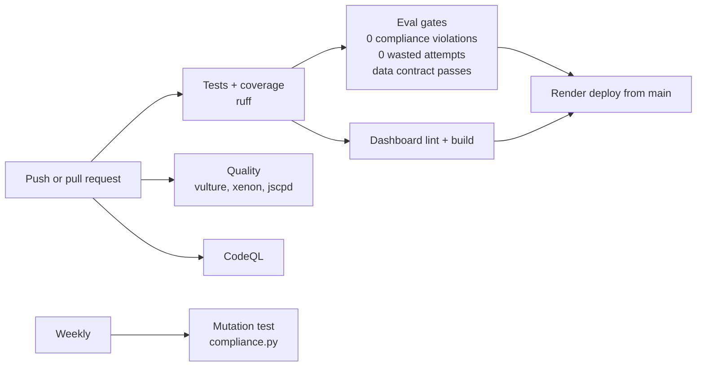
```mermaid
flowchart LR
    P["Push or pull request"] --> T["Tests + coverage<br/>ruff"]
    T --> G["Eval gates<br/>0 compliance violations<br/>0 wasted attempts<br/>data contract passes"]
    T --> D["Dashboard lint + build"]
    P --> Q["Quality<br/>vulture, xenon, jscpd"]
    P --> S["CodeQL"]
    W["Weekly"] --> M["Mutation test<br/>compliance.py"]
    G --> R["Render deploy from main"]
    D --> R
```

The eval summary (attempts, recoveries, wasted attempts, contract result) is written to each run's summary page by `scripts/ci_eval_summary.py`, which also fails the job if a gate breaks.

### Validate and deploy

`scripts/validate.sh` runs the whole pipeline in order and prints a pass/fail line per stage: lint, tests with coverage, the data contract, the eval harness gates and the dashboard build. These are the checks CI runs, so a green local run predicts a green build.

`render.yaml` is a Render blueprint with `autoDeployTrigger: checksPass`: a push to `main` deploys only after the GitHub checks pass. Secrets are declared with `sync: false` and entered in the Render dashboard, never committed.

### Is the synthetic data realistic?

There is no real failed-payment data, so realism cannot be measured. What is checked is rule compliance: a Pandera contract (`eval/data_contract.py`) validates 5,000 generated events against NPCI peak windows, the RBI Rs 15,000 authentication threshold, the mandate cap, documented Razorpay error reasons and one debit per cycle. The first run found real defects in the generator, which are fixed. See [docs/DATA_QUALITY.md](docs/DATA_QUALITY.md).

## Setup

    bash setup.sh
    cp .env.example .env    # fill in keys
    source .venv/bin/activate
    pytest

## Dashboard

A landing page first: the thesis, the headline result with its caveat in
the same sentence, and a plain scorecard — readable in under 30 seconds
without touching anything interactive. One button from there into the full
dashboard's four tabs: a Live Simulator (opt-in live mode — calls the real
pipeline through a small local API, never the real Razorpay API), plus
Story, Decision Trace, and Batch Results, which read from a saved run
artifact: static files only, no live calls. The batch study itself stays
fixed and pre-computed either way.

    # terminal 1 - backend for the Live Simulator tab
    source .venv/bin/activate
    uvicorn api.main:app --reload --port 8000

    # terminal 2 - dashboard
    cd dashboard
    npm install
    npm run dev

The other three tabs work fine without the backend running; only Live
Simulator needs it. See [dashboard/README.md](dashboard/README.md) for how
to refresh the batch data after a new run.
