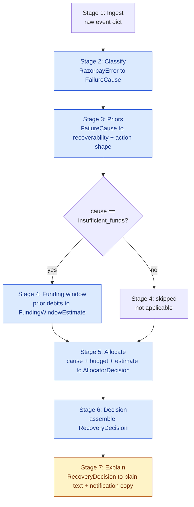
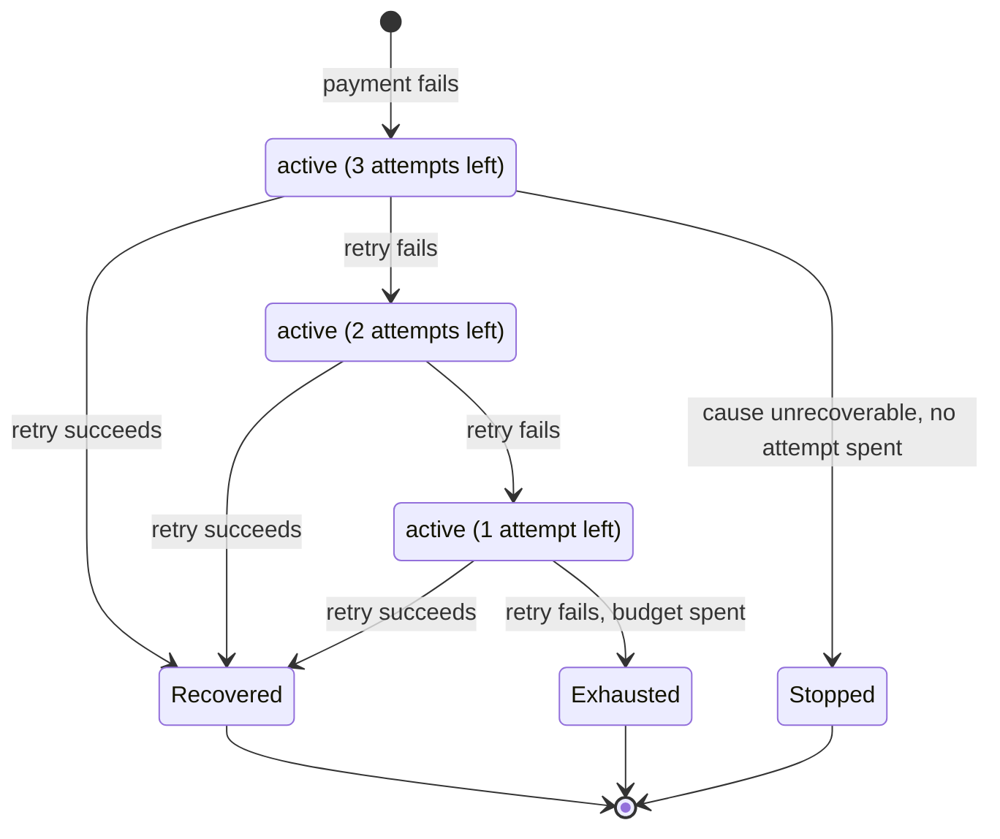

# Architecture

## Pipeline flowchart (PRD Sec 4)

Seven stages, one event at a time. Stage 4 only runs for `insufficient_funds`
- every other cause marks it skipped-with-reason (see `pipeline/run.py`).
Only Stage 7 calls an LLM; everything else is deterministic Python -
Stages 2/3/5/6 are the "opt for deterministic where AI is unnecessary"
answer to the AI Judgment criterion, marked below by shape.

Data contracts are the Pydantic models in `pipeline/models.py`,
`pipeline/ingest.py`, `pipeline/allocator.py`, and `pipeline/decision.py` -
every stage function is typed input to typed output, and every stage
returns a `StageTrace` (stage name, input/output summary, elapsed ms,
skipped-with-reason) alongside its result, collected by
`pipeline/run.py::run_pipeline`. The dashboard's Decision Trace view
renders these traces directly - not a mockup of the pipeline, the actual
executed trace.

## Decision flowchart (PRD Sec 4, Stage 5)

The allocator's actual branching logic - a non-technical reviewer should be
able to follow this without reading `pipeline/allocator.py`.

## Mandate lifecycle state diagram (PRD Sec 2 - bounded budget, explicit stop)

`Stopped` (spent 0 attempts) and `Exhausted` (spent all 3) are both terminal
but mean different things - the dashboard's Batch Results view reports them
separately (`attempts_wasted_on_unrecoverable_causes` vs
`stopped_early_count`) so a "0 recovered" outcome doesn't get read as one
undifferentiated failure mode.

## The deterministic/LLM boundary, and why

Stages 2, 3, 5, and 6 are pure Python: a lookup table, a scoring function,
a data-assembly function. None of them can be improved by a model call -
the inputs and outputs are fully specified (a Razorpay error object has a
finite, documented set of `reason` values; NPCI's compliance rules are
exact numbers, not judgment calls) and a model would only add latency,
cost, and a new failure mode for something a dict lookup already does
correctly and auditably. This is the explicit "AI Judgment" answer: using
AI *only* where it's actually needed.

Stage 7 is the one place an LLM adds real value - turning
`reasoning_technical` (a dense string like `cause=insufficient_funds
(confidence=1.0, matched_on=reason:insufficient_funds);
recoverability=0.7; action=retry; chose 72h (score=0.7)`) into plain
sentences for two different audiences (compliance officer, customer), and
generating Hinglish notification copy - a genuinely open-ended language
task, not a decision. Called *after* `pipeline/allocator.py` has already
decided; `pipeline/explain.py::generate_explanation` takes a finished
`RecoveryDecision` and never returns anything the allocator reads back.

Kept off the critical path deliberately: every LLM call is wrapped in
`try/except`, and any failure (auth, rate limit, malformed JSON, empty/
truncated response) falls back to a deterministic template
(`pipeline/decision.py::_template_reasoning_plain` and
`pipeline/explain.py`'s notification templates) - confirmed live during
this build when the configured model was pulled from OpenRouter's free
tier mid-session and a second model returned a truncated response; both
degraded cleanly with zero pipeline impact (`docs/build-log.md`).

## Compliance invariants and where they're enforced

Three invariants (PRD Sec 2), proven in `pipeline/compliance.py` and
`tests/test_compliance.py` *before* any allocator logic was written
(build order step 2):

| Invariant | Enforced in | Checked |
|---|---|---|
| Never more than 3 retry attempts per mandate | `attempts_within_cap` | `pipeline/allocator.py` (early-return before scoring), `eval/harness.py` (asserted per simulated attempt), dashboard's live compliance panel |
| Never schedule inside a peak window (10:00-13:00, 17:00-21:30 IST) | `is_peak_window`, `shift_out_of_peak` | Candidate generation only ever returns compliant times; re-asserted with a runtime `assert` in `allocate()`; re-checked in `eval/harness.py`; re-checked live in the dashboard (`dashboard/src/lib/compliance.js`, a JS port of the same logic) |
| At most one successful debit per token per billing cycle | Structural - `eval/harness.py`'s simulation loop stops immediately on the first recorded success | Not independently re-derivable from a single-failure-event batch; stated honestly as "enforced by construction" rather than faked as a live data check in the dashboard - see `dashboard/src/lib/compliance.js` |

`tests/test_compliance.py` covers every minute-level boundary of both peak
windows and both cap edges (3 ok, 4 violates) before either the allocator
or the baseline existed.

## Data provenance (PRD Sec 5.0)

Two tiers, and the pipeline cannot tell the difference between them because
the schema contract is identical:

- **Integration tier (real, small):** `scripts/capture_fixtures.py` ran
  live against Razorpay's TEST-mode API. Customer and order creation
  succeeded genuinely; UPI AutoPay mandate/charge creation is gated behind
  a Razorpay Support activation this account doesn't have (confirmed via 4
  independent probes plus an external source - `data/fixtures/README.md`
  has the full finding). The one genuinely live-captured error payload
  (`data/fixtures/unknown.json`) and the real customer/order responses
  (`data/fixtures/_capture_attempts.json`) are real evidence of a genuine
  integration attempt, not fabricated.
- **Batch tier (replayed, large):** the other 6 fixtures are sourced
  verbatim from Razorpay's own published error-code documentation
  (`code`/`description`/`source`/`step`/`reason` fields, real values), with
  the three mandate/AFA-layer causes explicitly marked provisional since
  Razorpay doesn't publish a dedicated error `reason` for them.
  `eval/batch_generator.py` synthesizes 60 events by resampling these exact
  fixture payloads, so `classify.py` sees the identical schema it would see
  from a real capture.

## Outcome model isolation (PRD Sec 5.1)

`eval/outcome_model.py` defines the "true" success probability the
simulation draws from - frozen, seeded, documented with its own parameters
before any allocator scoring logic was tuned against it.
`pipeline/allocator.py` never imports it, which would make the evaluation
circular (the allocator would effectively be told the answer). This isn't
just a convention: `tests/test_outcome_model_isolation.py` parses every
file under `pipeline/` with Python's `ast` module and fails the build if
any import statement references `outcome_model`.

## The live simulator (PRD Sec 6.2's opt-in "live mode")

Every other view in the dashboard reads a pre-computed JSON file. The Live
Simulator tab is the one exception, and it exists specifically so a viewer
can trigger genuine computation instead of trusting a static screenshot -
PRD Sec 6.2 requires exactly this: "a live mode exists but is opt-in, for
showing the real integration when the network cooperates."

**Architecture:** `api/main.py` is a small FastAPI process (`uvicorn
api.main:app --port 8000`) that exposes `POST /api/simulate` over HTTP so
the browser can call it. It does not reimplement any decision logic - it
calls the exact same functions the batch harness calls:
`pipeline.ingest.run_ingestion`, `pipeline.run.run_pipeline` (Stages 2-6),
`pipeline.explain.run_explanation` (Stage 7, real LLM call with its
existing disk-cache-free live fallback), and `eval.baseline.baseline_decide`
for the comparison shown alongside. `api/personas.py` holds four named
demo scenarios, each built from a real fixture in `data/fixtures/` - not
invented payloads.

**What it deliberately does NOT do:** call `eval/outcome_model.py`. A live
run produces a `RecoveryDecision` - a classification and a choice - never a
simulated recovered/not-recovered result. Simulating an outcome would mean
importing the frozen outcome model into a live-facing path, which is
exactly the circularity Sec 5.1 isolates the allocator from. The dashboard's
Story/Decision Trace views were built to always show a simulated outcome
(`payment.allocator.recovered`, etc.); reusing them for live results meant
teaching them to render an honest "no outcome to show - a live decision
doesn't simulate whether a debit succeeds" state instead of fabricating
one, rather than bypassing that check.

**Never touches the real Razorpay API.** The only external call anywhere in
this path is the same Stage 7 LLM call every other part of the pipeline
already makes, subject to the same try/except fallback.

## Design trade-offs - considered and rejected

Three specific decisions, framed as what else was on the table and why it
lost, not just the choice made.

**Funding-confidence threshold = 0.6 (`FUNDING_CONFIDENCE_THRESHOLD` in
`.env`).** `pipeline/funding_window.py` blends a customer's observed debit
history with a generic salary-credit prior; confidence rises with more,
more-consistent observations. A lower threshold (e.g. 0.3) would let
thinner history clear the bar and produce a real window estimate more
often - more "coverage," but weaker estimates get treated as trustworthy,
which is exactly the overclaiming PRD Sec 8 warns is "the most likely way
to be picked apart in a demo." A higher threshold (e.g. 0.85) would almost
never clear given the batch generator's synthetic history (3-5 noisy
observations per customer, see `_synthesize_prior_debit_dates`), making
Stage 4 functionally always-fallback and pointless to have built. 0.6 was
chosen as the midpoint that lets consistent 3+ observation histories clear
it (see `docs/RESULTS.md` Section 4 - 31% fallback rate in practice) while
still rejecting thin or scattered ones. Not derived from any real
delinquency data - there isn't any in this project - a declared choice,
adjustable via `.env` without a code change.

**Retry offsets fixed at 24h / 72h / 168h.** This is not a tunable - PRD
Sec 2 cites this exact spacing as published industry practice ("recover
15-20% of failed payments"), so it's treated as a hard input, not a design
choice this codebase made. The alternative considered was baseline's own
denser day-1/2/3 (24h/48h/72h) packing, which the sensitivity sweep
(`docs/RESULTS.md` Section 4) shows genuinely outperforms the wider
schedule when a customer's funding event lands early - the wider schedule
is deliberately kept anyway because it's the one PRD Sec 2 documents, not
because it wins on every metric. This is exactly the case CLAUDE.md
anticipates: "if the allocator only wins under one parameter setting, that
is the finding, report it."

**Scoring function: `recoverability x a declared offset preference`, not a
probability.** The allocator's `_OFFSET_WEIGHTS` (`pipeline/allocator.py`)
rank the 3 fixed offsets by a hand-authored preference, not by calling any
probability model - because the only probability model that exists
(`eval/outcome_model.py`) must stay isolated from the allocator (Sec 5.1);
letting the allocator score against real P(success) would make the
evaluation circular. The rejected alternative was building a second,
allocator-visible probability estimate (a "public" model distinct from the
frozen "true" one) - rejected because maintaining two probability models
that are supposed to approximate the same real-world quantity, one hidden
from evaluation and one visible to the decision code, is a correctness trap
waiting to happen (they drift, and nothing catches it). The declared
heuristic's *shape* still has to be internally consistent, though - a real
bug found in this same session (see `docs/build-log.md`, 2026-09-04): the
`insufficient_funds` weights originally ranked the offset farthest from the
declared "middle guess" above the one closer to it, contradicting the
heuristic's own stated rationale. Fixed by reweighting on actual distance
from the middle checkpoint, not by giving the allocator a peek at the real
model.

## Known limitations

See `docs/RESULTS.md` Section 7 for the full, evidenced list (simulation
study, modelled failure mix, narrow-effect funding-window inference, small
N, provisional fixtures, scheduler-enforced rather than NPCI-enforced
compliance).
