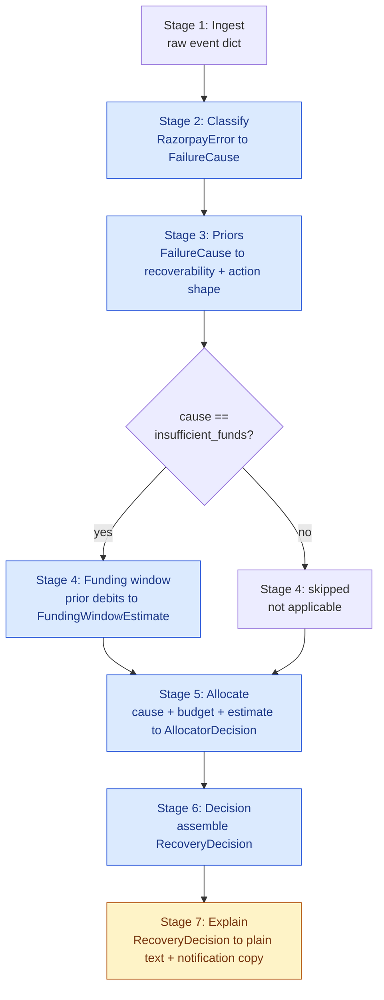
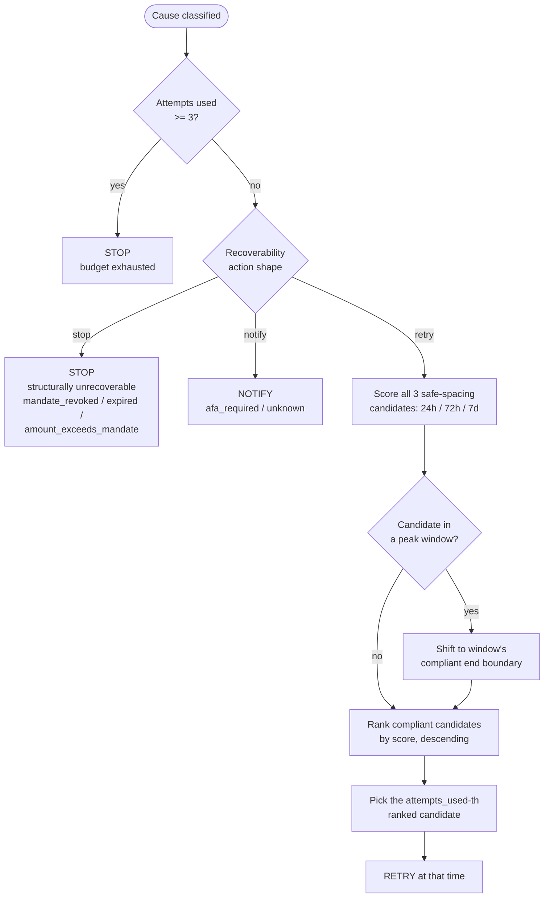
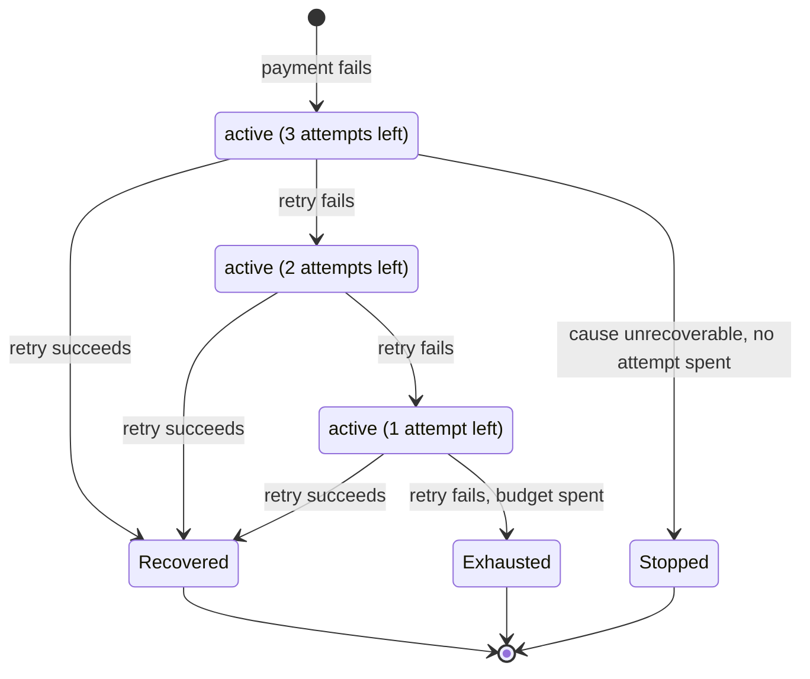

# Architecture

## Pipeline flowchart (PRD Sec 4)

Seven stages, one event at a time. Stage 4 only runs for `insufficient_funds`;
every other cause marks it skipped-with-reason (see `pipeline/run.py`).
Only Stage 7 calls an LLM — everything else is deterministic Python, and
Stages 2/3/5/6 are the "opt for deterministic where AI is unnecessary"
answer to the AI Judgment criterion, marked below by shape.

Data contracts live as Pydantic models in `pipeline/models.py`,
`pipeline/ingest.py`, `pipeline/allocator.py`, and `pipeline/decision.py` -
every stage function is typed input to typed output. Each stage also
returns a `StageTrace` (stage name, input/output summary, elapsed ms,
skipped-with-reason) alongside its result, collected by
`pipeline/run.py::run_pipeline`. The dashboard's Decision Trace view
renders these traces directly, so what a viewer sees there is the actual
executed trace, not a mockup built to look like one.

## Decision flowchart (PRD Sec 4, Stage 5)

The allocator's actual branching logic, laid out so a non-technical
reviewer can follow it without reading `pipeline/allocator.py`.

## Mandate lifecycle state diagram (PRD Sec 2 - bounded budget, explicit stop)

`Stopped` (0 attempts spent) and `Exhausted` (all 3 spent) are both
terminal states but mean different things, so the dashboard's Batch
Results view reports them separately
(`attempts_wasted_on_unrecoverable_causes` vs `stopped_early_count`)
rather than folding "0 recovered" into one undifferentiated failure
bucket.

## The deterministic/LLM boundary, and why

Stages 2, 3, 5, and 6 are pure Python - a lookup table, a scoring
function, a data-assembly function. None of them benefit from a model
call: the inputs and outputs are fully specified (a Razorpay error object
has a finite, documented set of `reason` values; NPCI's compliance rules
are exact numbers, not judgment calls), so a model would only add
latency, cost, and a new failure mode on top of something a dict lookup
already does correctly. This is the "AI Judgment" answer stated plainly:
use AI where it's actually needed, and nowhere else.

Stage 7 is the one place an LLM earns its keep - turning
`reasoning_technical` (a dense string like `cause=insufficient_funds
(confidence=1.0, matched_on=reason:insufficient_funds);
recoverability=0.7; action=retry; chose 72h (score=0.7)`) into plain
sentences for two different audiences, a compliance officer and a
customer, and writing customer notification copy - an open-ended
language task rather than a decision. It runs after
`pipeline/allocator.py` has already decided;
`pipeline/explain.py::generate_explanation` takes a finished
`RecoveryDecision` and hands nothing back that the allocator reads.

It's kept off the critical path on purpose. Every LLM call is wrapped in
`try/except`, and any failure - auth, rate limit, malformed JSON, an
empty or truncated response - falls back to a deterministic template
(`pipeline/decision.py::_template_reasoning_plain` and
`pipeline/explain.py`'s own notification templates). That design got a
real test mid-build: the configured model was pulled from OpenRouter's
free tier partway through this session, and a second model returned a
truncated response after that. Both degraded cleanly with zero pipeline
impact (`docs/build-log.md`).

## Compliance invariants and where they're enforced

Three invariants (PRD Sec 2), proven in `pipeline/compliance.py` and
`tests/test_compliance.py` before any allocator logic existed (build
order step 2):

| Invariant | Enforced in | Checked |
|---|---|---|
| Never more than 3 retry attempts per mandate | `attempts_within_cap` | `pipeline/allocator.py` (early-return before scoring), `eval/harness.py` (asserted per simulated attempt), dashboard's live compliance panel |
| Never schedule inside a peak window (10:00-13:00, 17:00-21:30 IST) | `is_peak_window`, `shift_out_of_peak` | Candidate generation only ever returns compliant times; re-asserted with a runtime `assert` in `allocate()`; re-checked in `eval/harness.py`; re-checked live in the dashboard (`dashboard/src/lib/compliance.js`, a JS port of the same logic) |
| At most one successful debit per token per billing cycle | Structural - `eval/harness.py`'s simulation loop stops immediately on the first recorded success | Not independently re-derivable from a single-failure-event batch, so this is stated as "enforced by construction" in the dashboard rather than faked as a live data check - see `dashboard/src/lib/compliance.js` |

`tests/test_compliance.py` covers every minute-level boundary of both
peak windows and both cap edges (3 is fine, 4 violates) - written before
either the allocator or the baseline existed.

## Data provenance (PRD Sec 5.0)

Two tiers, and the pipeline can't tell them apart because the schema
contract is identical either way:

- **Integration tier (small, live):** `scripts/capture_fixtures.py` ran
  against Razorpay's TEST-mode API. Customer and order creation
  succeeded; UPI AutoPay mandate/charge creation is gated behind a
  Razorpay Support activation this account doesn't have, confirmed via 4
  independent probes plus an external source (`data/fixtures/README.md`
  has the full finding). What did get captured live - one error payload
  (`data/fixtures/unknown.json`) and the real customer/order responses
  (`data/fixtures/_capture_attempts.json`) - is evidence of a genuine
  integration attempt against the real account, not something written by
  hand.
- **Batch tier (large, replayed):** the other 6 fixtures come verbatim
  from Razorpay's own published error-code documentation
  (`code`/`description`/`source`/`step`/`reason` fields), with the three
  mandate/AFA-layer causes explicitly marked provisional since Razorpay
  doesn't publish a dedicated `reason` for any of them.
  `eval/batch_generator.py` synthesizes 60 events by resampling these
  exact fixture payloads, so `classify.py` sees the same schema it would
  see from a live capture.

## Outcome model isolation (PRD Sec 5.1)

`eval/outcome_model.py` defines the "true" success probability the
simulation draws from - frozen, seeded, and documented with its own
parameters before any allocator scoring logic was tuned against it.
`pipeline/allocator.py` never imports it, because doing so would make the
evaluation circular: the allocator would effectively be told the answer.
This isn't left as a convention to honor - `tests/test_outcome_model_
isolation.py` parses every file under `pipeline/` with Python's `ast`
module and fails the build if any import statement references
`outcome_model`.

## The live simulator (PRD Sec 6.2's opt-in "live mode")

Every other view in the dashboard reads a pre-computed JSON file. The
Live Simulator tab is the one exception, built specifically so a viewer
can trigger actual computation instead of taking a static screenshot on
faith - which is what PRD Sec 6.2 asks for: "a live mode exists but is
opt-in, for showing the real integration when the network cooperates."

**Architecture:** `api/main.py` is a small FastAPI process (`uvicorn
api.main:app --port 8000`) exposing `POST /api/simulate` so the browser
can call it. It doesn't reimplement any decision logic - it calls the
same functions the batch harness calls: `pipeline.ingest.run_ingestion`,
`pipeline.run.run_pipeline` (Stages 2-6), `pipeline.explain.
run_explanation` (Stage 7, a live LLM call with its existing fallback
behavior), and `eval.baseline.baseline_decide` for the comparison shown
alongside. `api/personas.py` holds four named demo scenarios, each built
from an actual fixture in `data/fixtures/` rather than a made-up payload.

**What it deliberately skips:** `eval/outcome_model.py`. A live run
produces a `RecoveryDecision` - a classification and a choice - never a
simulated recovered/not-recovered result. Simulating an outcome here
would mean importing the frozen outcome model into a live-facing path,
which is the exact circularity Sec 5.1 keeps the allocator away from. The
dashboard's Story and Decision Trace views were originally built to
always show a simulated outcome (`payment.allocator.recovered`, etc.), so
reusing them for live results meant teaching them a third state: "no
outcome to show - a live decision doesn't simulate whether a debit
succeeds," shown honestly instead of skipping the check that would have
caught this.

**Never touches the real Razorpay API.** The only external call anywhere
in this path is the same Stage 7 LLM call every other part of the
pipeline already makes, with the same try/except fallback.

## Design trade-offs - considered and rejected

Three specific decisions, each framed as what else was on the table and
why it lost - not just the choice that shipped.

**Funding-confidence threshold = 0.6 (`FUNDING_CONFIDENCE_THRESHOLD` in
`.env`).** `pipeline/funding_window.py` blends a customer's observed
debit history with a generic salary-credit prior; confidence rises with
more, more-consistent observations. A lower threshold, say 0.3, would let
thinner history clear the bar and produce a window estimate more often -
more coverage, but weaker estimates start getting treated as trustworthy,
which is exactly the overclaiming PRD Sec 8 warns is "the most likely way
to be picked apart in a demo." A higher threshold, say 0.85, would almost
never clear given the batch generator's synthetic history (3-5 noisy
observations per customer, see `_synthesize_prior_debit_dates`), making
Stage 4 functionally always-fallback and not worth having built. 0.6 sits
at the midpoint: consistent 3+ observation histories clear it (see
`docs/RESULTS.md` Section 4 - 31% fallback rate in practice), thin or
scattered ones don't. Not derived from any delinquency data, because
there isn't any in this project - a declared choice, adjustable via
`.env` with no code change.

**Retry offsets fixed at 24h / 72h / 168h.** Not a tunable - PRD Sec 2
cites this exact spacing as published industry practice ("recover 15-20%
of failed payments"), so it's treated as a hard input rather than
something this codebase decided on its own. The alternative on the table
was baseline's own denser day-1/2/3 packing (24h/48h/72h), which the
sensitivity sweep (`docs/RESULTS.md` Section 4) shows actually
outperforms the wider schedule when a customer's funding event lands
early. The wider schedule stays anyway, because it's the one PRD Sec 2
documents, not because it wins on every metric - which is exactly the
case CLAUDE.md anticipates: "if the allocator only wins under one
parameter setting, that is the finding, report it."

**Scoring function: `recoverability x a declared offset preference`, not
a probability.** The allocator's `_OFFSET_WEIGHTS` (`pipeline/
allocator.py`) rank the 3 fixed offsets by a hand-authored preference
rather than by calling any probability model, because the only
probability model that exists (`eval/outcome_model.py`) has to stay
isolated from the allocator (Sec 5.1) - letting the allocator score
against actual P(success) would make the evaluation circular. The
rejected alternative was a second, allocator-visible probability
estimate: a "public" model distinct from the frozen "true" one. That got
turned down because two probability models meant to approximate the same
real-world quantity, one hidden and one visible, is a correctness trap
waiting to happen - they drift apart eventually, and nothing catches it
when they do. The declared heuristic's shape still has to hold together
internally, though, and a bug found this same session shows why: the
`insufficient_funds` weights originally ranked the offset farthest from
the declared "middle guess" above the one closer to it, contradicting the
heuristic's own stated rationale (see `docs/build-log.md`, 2026-09-04).
Fixed by reweighting on actual distance from the middle checkpoint - not
by giving the allocator a peek at the real model.

## Known limitations

See `docs/RESULTS.md` Section 7 for the full, evidenced list: simulation
study, modelled failure mix, narrow-effect funding-window inference,
small N, provisional fixtures, scheduler-enforced rather than
NPCI-enforced compliance.
